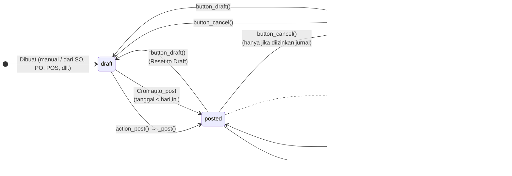
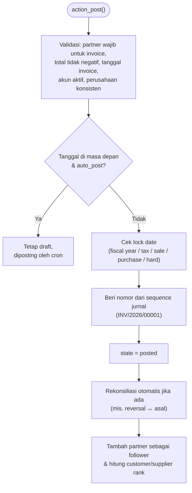

```mermaid
stateDiagram-v2
    direction LR
    [*] --> draft : Dibuat (manual / dari SO, PO, POS, dll.)
    draft --> posted : action_post() → _post()
    draft --> posted : Cron auto_post<br/>(tanggal ≤ hari ini)
    posted --> draft : button_draft()<br/>(Reset to Draft)
    posted --> cancel : button_cancel()<br/>(hanya jika diizinkan jurnal)
    draft --> cancel : button_cancel()
    cancel --> draft : button_draft()
    posted --> posted : Payment / rekonsiliasi<br/>(payment_state berubah)

    note right of posted
        Nomor final (sequence) diberikan saat post.
        Tidak bisa diubah jika di bawah lock date
        atau sudah di-hash (inalterable).
    end note
```

Yang terjadi pada **`_post()`**:

```mermaid
flowchart TB
    A(["action_post()"]) --> B["Validasi: partner wajib untuk invoice,<br/>total tidak negatif, tanggal invoice,<br/>akun aktif, perusahaan konsisten"]
    B --> C{"Tanggal di masa depan<br/>& auto_post?"}
    C -- Ya --> C1["Tetap draft,<br/>diposting oleh cron"]
    C -- Tidak --> D["Cek lock date<br/>(fiscal year / tax / sale / purchase / hard)"]
    D --> E["Beri nomor dari sequence jurnal<br/>(INV/2026/00001)"]
    E --> F["state = posted"]
    F --> G["Rekonsiliasi otomatis jika ada<br/>(mis. reversal ↔ asal)"]
    G --> H["Tambah partner sebagai follower<br/>& hitung customer/supplier rank"]
```

---

_Sumber: dokumentasi_accounting_odoo.md §4_
