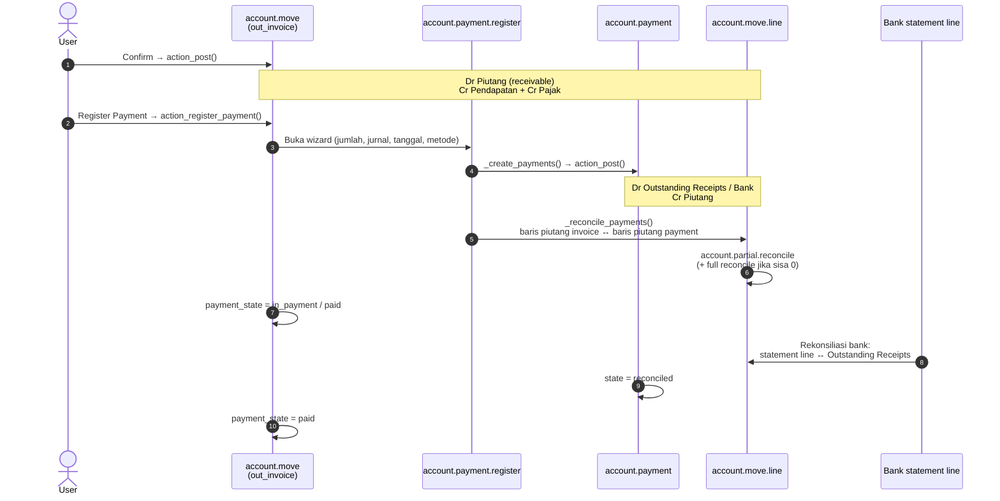

```mermaid
sequenceDiagram
    autonumber
    actor U as User
    participant INV as account.move<br/>(out_invoice)
    participant W as account.payment.register
    participant P as account.payment
    participant AML as account.move.line
    participant BSL as Bank statement line

    U->>INV: Confirm → action_post()
    Note over INV,AML: Dr Piutang (receivable)<br/>Cr Pendapatan + Cr Pajak
    U->>INV: Register Payment → action_register_payment()
    INV->>W: Buka wizard (jumlah, jurnal, tanggal, metode)
    W->>P: _create_payments() → action_post()
    Note over P,AML: Dr Outstanding Receipts / Bank<br/>Cr Piutang
    W->>AML: _reconcile_payments()<br/>baris piutang invoice ↔ baris piutang payment
    AML->>AML: account.partial.reconcile<br/>(+ full reconcile jika sisa 0)
    INV->>INV: payment_state = in_payment / paid
    BSL->>AML: Rekonsiliasi bank:<br/>statement line ↔ Outstanding Receipts
    P->>P: state = reconciled
    INV->>INV: payment_state = paid
```

---

_Sumber: dokumentasi_accounting_odoo.md §6_
