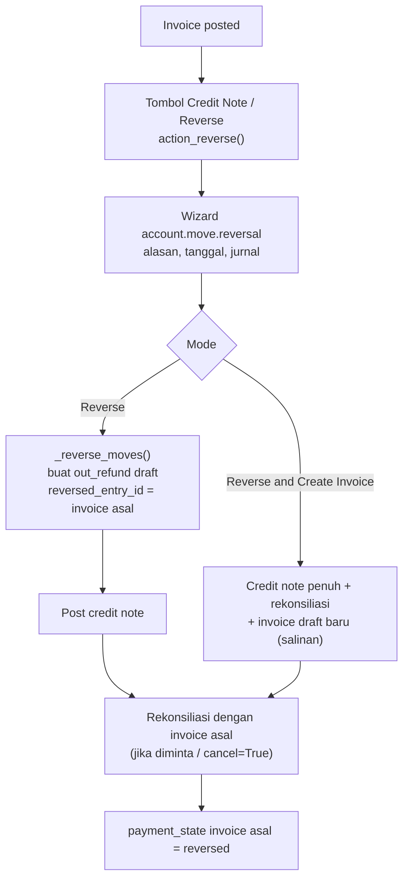

```mermaid
flowchart TB
    A["Invoice posted"] --> B["Tombol Credit Note / Reverse<br/>action_reverse()"]
    B --> W["Wizard account.move.reversal<br/>alasan, tanggal, jurnal"]
    W --> C{"Mode"}
    C -- "Reverse" --> D["_reverse_moves()<br/>buat out_refund draft<br/>reversed_entry_id = invoice asal"]
    C -- "Reverse and Create Invoice" --> E["Credit note penuh + rekonsiliasi<br/>+ invoice draft baru (salinan)"]
    D --> F["Post credit note"]
    F --> G["Rekonsiliasi dengan invoice asal<br/>(jika diminta / cancel=True)"]
    E --> G
    G --> H["payment_state invoice asal = reversed"]
```

---

_Sumber: dokumentasi_accounting_odoo.md §9_
