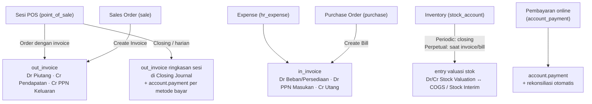

```mermaid
flowchart TB
    SO["Sales Order (sale)"] -->|"Create Invoice"| OI["out_invoice<br/>Dr Piutang · Cr Pendapatan · Cr PPN Keluaran"]
    PO["Purchase Order (purchase)"] -->|"Create Bill"| II["in_invoice<br/>Dr Beban/Persediaan · Dr PPN Masukan · Cr Utang"]
    POS["Sesi POS (point_of_sale)"] -->|"Closing / harian"| PR["out_invoice ringkasan sesi<br/>di Closing Journal<br/>+ account.payment per metode bayar"]
    POS -->|"Order dengan invoice"| OI
    STK["Inventory (stock_account)"] -->|"Periodic: closing<br/>Perpetual: saat invoice/bill"| SV["entry valuasi stok<br/>Dr/Cr Stock Valuation ↔ COGS / Stock Interim"]
    PAY["Pembayaran online<br/>(account_payment)"] --> AP["account.payment<br/>+ rekonsiliasi otomatis"]
    EXP["Expense (hr_expense)"] --> II
```

---

_Sumber: dokumentasi_accounting_odoo.md §11_
