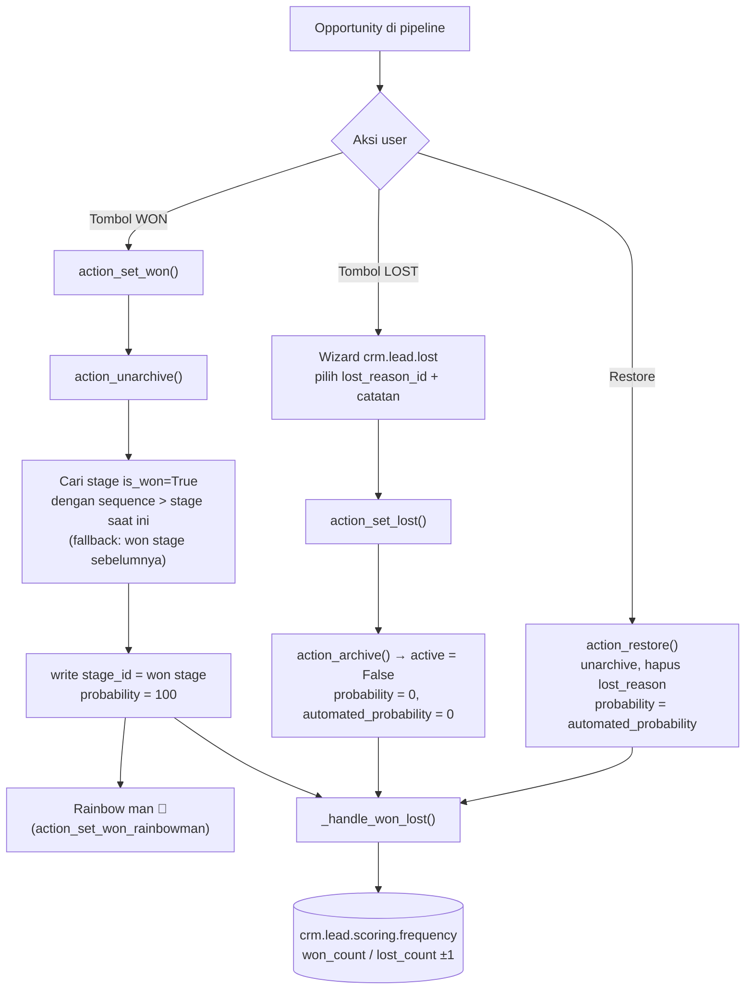

Setiap perubahan status won/lost memicu `_handle_won_lost()` yang memperbarui **tabel frekuensi** Predictive Lead Scoring.

```mermaid
flowchart TB
    A["Opportunity di pipeline"] --> B{"Aksi user"}

    B -- "Tombol WON" --> W1["action_set_won()"]
    W1 --> W2["action_unarchive()"]
    W2 --> W3["Cari stage is_won=True<br/>dengan sequence > stage saat ini<br/>(fallback: won stage sebelumnya)"]
    W3 --> W4["write stage_id = won stage<br/>probability = 100"]
    W4 --> W5["Rainbow man 🎉<br/>(action_set_won_rainbowman)"]

    B -- "Tombol LOST" --> L1["Wizard crm.lead.lost<br/>pilih lost_reason_id + catatan"]
    L1 --> L2["action_set_lost()"]
    L2 --> L3["action_archive() → active = False<br/>probability = 0, automated_probability = 0"]

    B -- "Restore" --> R1["action_restore()<br/>unarchive, hapus lost_reason<br/>probability = automated_probability"]

    W4 --> H["_handle_won_lost()"]
    L3 --> H
    R1 --> H
    H --> F[("crm.lead.scoring.frequency<br/>won_count / lost_count ±1")]
```

---

_Sumber: dokumentasi_crm_odoo.md §6_
