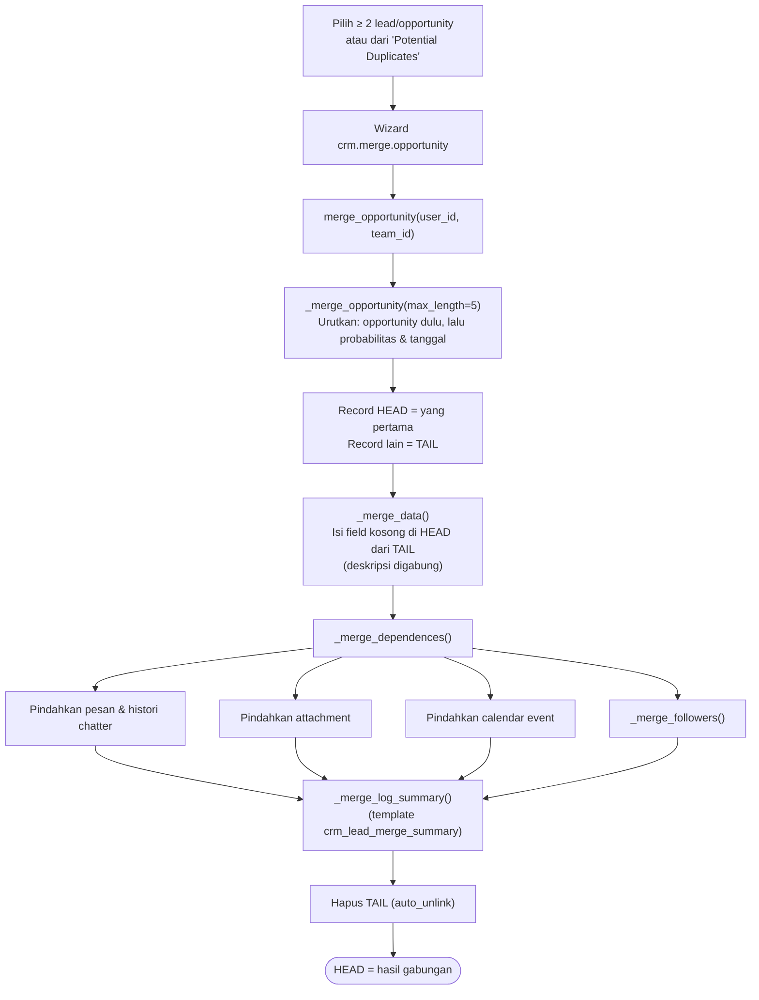

```mermaid
flowchart TB
    A["Pilih ≥ 2 lead/opportunity<br/>atau dari 'Potential Duplicates'"] --> B["Wizard crm.merge.opportunity"]
    B --> C["merge_opportunity(user_id, team_id)"]
    C --> D["_merge_opportunity(max_length=5)<br/>Urutkan: opportunity dulu, lalu probabilitas & tanggal"]
    D --> E["Record HEAD = yang pertama<br/>Record lain = TAIL"]
    E --> F["_merge_data()<br/>Isi field kosong di HEAD dari TAIL<br/>(deskripsi digabung)"]
    F --> G["_merge_dependences()"]
    G --> G1["Pindahkan pesan & histori chatter"]
    G --> G2["Pindahkan attachment"]
    G --> G3["Pindahkan calendar event"]
    G --> G4["_merge_followers()"]
    G1 & G2 & G3 & G4 --> H["_merge_log_summary()<br/>(template crm_lead_merge_summary)"]
    H --> I["Hapus TAIL (auto_unlink)"]
    I --> J(["HEAD = hasil gabungan"])
```

---

_Sumber: dokumentasi_crm_odoo.md §9_
