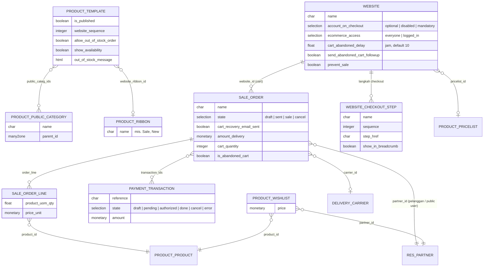

```mermaid
erDiagram
    WEBSITE {
        char name
        selection account_on_checkout "optional | disabled | mandatory"
        selection ecommerce_access "everyone | logged_in"
        float cart_abandoned_delay "jam, default 10"
        boolean send_abandoned_cart_followup
        boolean prevent_sale
    }
    PRODUCT_TEMPLATE {
        boolean is_published
        integer website_sequence
        boolean allow_out_of_stock_order
        boolean show_availability
        html out_of_stock_message
    }
    PRODUCT_PUBLIC_CATEGORY {
        char name
        many2one parent_id
    }
    PRODUCT_RIBBON {
        char name "mis. Sale, New"
    }
    SALE_ORDER {
        char name
        selection state "draft | sent | sale | cancel"
        boolean cart_recovery_email_sent
        monetary amount_delivery
        integer cart_quantity
        boolean is_abandoned_cart
    }
    SALE_ORDER_LINE {
        float product_uom_qty
        monetary price_unit
    }
    PAYMENT_TRANSACTION {
        char reference
        selection state "draft | pending | authorized | done | cancel | error"
        monetary amount
    }
    WEBSITE_CHECKOUT_STEP {
        char name
        integer sequence
        char step_href
        boolean show_in_breadcrumb
    }
    PRODUCT_WISHLIST {
        monetary price
    }

    WEBSITE ||--o{ SALE_ORDER : "website_id (cart)"
    WEBSITE }o--o| PRODUCT_PRICELIST : pricelist_id
    WEBSITE ||--o{ WEBSITE_CHECKOUT_STEP : "langkah checkout"
    PRODUCT_TEMPLATE }o--o{ PRODUCT_PUBLIC_CATEGORY : public_categ_ids
    PRODUCT_TEMPLATE }o--o| PRODUCT_RIBBON : website_ribbon_id
    SALE_ORDER ||--o{ SALE_ORDER_LINE : order_line
    SALE_ORDER_LINE }o--|| PRODUCT_PRODUCT : product_id
    SALE_ORDER }o--|| RES_PARTNER : "partner_id (pelanggan / public user)"
    SALE_ORDER }o--o| DELIVERY_CARRIER : carrier_id
    SALE_ORDER }o--o{ PAYMENT_TRANSACTION : transaction_ids
    PRODUCT_WISHLIST }o--|| PRODUCT_PRODUCT : product_id
    PRODUCT_WISHLIST }o--|| RES_PARTNER : partner_id
```

---

_Sumber: dokumentasi_website_sale_odoo.md §2_
