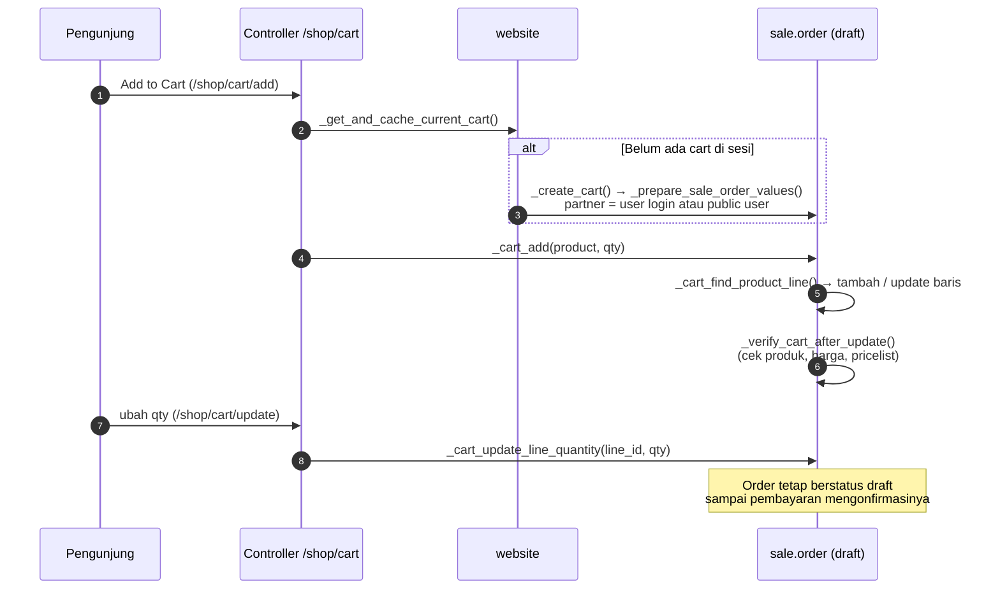

```mermaid
sequenceDiagram
    autonumber
    participant V as Pengunjung
    participant C as Controller /shop/cart
    participant W as website
    participant SO as sale.order (draft)

    V->>C: Add to Cart (/shop/cart/add)
    C->>W: _get_and_cache_current_cart()
    alt Belum ada cart di sesi
        W->>SO: _create_cart() → _prepare_sale_order_values()<br/>partner = user login atau public user
    end
    C->>SO: _cart_add(product, qty)
    SO->>SO: _cart_find_product_line() → tambah / update baris
    SO->>SO: _verify_cart_after_update()<br/>(cek produk, harga, pricelist)
    V->>C: ubah qty (/shop/cart/update)
    C->>SO: _cart_update_line_quantity(line_id, qty)
    Note over SO: Order tetap berstatus draft<br/>sampai pembayaran mengonfirmasinya
```

---

_Sumber: dokumentasi_website_sale_odoo.md §4_
