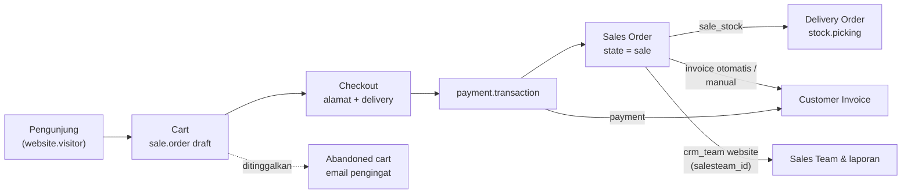

```mermaid
flowchart LR
    VIS["Pengunjung<br/>(website.visitor)"] --> CART["Cart<br/>sale.order draft"]
    CART --> CHK["Checkout<br/>alamat + delivery"]
    CHK --> PAY["payment.transaction"]
    PAY --> SO["Sales Order<br/>state = sale"]
    SO -->|"sale_stock"| DO["Delivery Order<br/>stock.picking"]
    SO -->|"invoice otomatis /<br/>manual"| INV["Customer Invoice"]
    PAY -->|"payment"| INV
    SO -->|"crm_team website<br/>(salesteam_id)"| TEAM["Sales Team & laporan"]
    CART -. "ditinggalkan" .-> ABD["Abandoned cart<br/>email pengingat"]
```

---

_Sumber: dokumentasi_website_sale_odoo.md §7_
