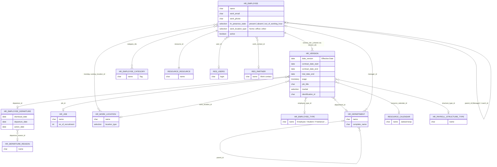

```mermaid
erDiagram
    HR_EMPLOYEE {
        char name
        char work_email
        char work_phone
        selection hr_presence_state "present | absent | out_of_working_hour"
        selection work_location_type "home | office | other"
        boolean active
    }
    HR_VERSION {
        date date_version "Effective Date"
        date contract_date_start
        date contract_date_end
        date trial_date_end
        monetary wage
        char job_title
        selection marital
        char identification_id
    }
    HR_DEPARTMENT {
        char name
        char complete_name
    }
    HR_JOB {
        char name
        int no_of_recruitment
    }
    HR_EMPLOYEE_CATEGORY {
        char name "Tag"
    }
    HR_WORK_LOCATION {
        char name
        selection location_type
    }
    HR_EMPLOYEE_TYPE {
        char name "Employee / Student / Freelancer ..."
    }
    HR_EMPLOYEE_DEPARTURE {
        date dismissal_date
        date departure_date
        date action_date
    }
    HR_DEPARTURE_REASON {
        char name
    }
    RESOURCE_CALENDAR {
        char name "Jadwal kerja"
    }
    RESOURCE_RESOURCE {
        char name
    }
    RES_USERS {
        char login
    }
    RES_PARTNER {
        char name "Work contact"
    }
    HR_PAYROLL_STRUCTURE_TYPE {
        char name
    }

    HR_EMPLOYEE ||--|{ HR_VERSION : "version_ids (_inherits via version_id)"
    HR_EMPLOYEE ||--|| RESOURCE_RESOURCE : resource_id
    HR_EMPLOYEE }o--o| RES_USERS : user_id
    HR_EMPLOYEE }o--o| RES_PARTNER : work_contact_id
    HR_EMPLOYEE }o--o| HR_EMPLOYEE : "parent_id (Manager) / coach_id"
    HR_EMPLOYEE }o--o{ HR_EMPLOYEE_CATEGORY : category_ids
    HR_EMPLOYEE }o--o{ HR_WORK_LOCATION : "monday..sunday_location_id"
    HR_VERSION }o--o| HR_DEPARTMENT : department_id
    HR_VERSION }o--o| HR_JOB : job_id
    HR_VERSION }o--o| RESOURCE_CALENDAR : resource_calendar_id
    HR_VERSION }o--o| HR_WORK_LOCATION : work_location_id
    HR_VERSION }o--o| HR_EMPLOYEE_TYPE : employee_type_id
    HR_VERSION }o--o| HR_PAYROLL_STRUCTURE_TYPE : structure_type_id
    HR_VERSION }o--o| HR_EMPLOYEE_DEPARTURE : departure_id
    HR_EMPLOYEE_DEPARTURE }o--o| HR_DEPARTURE_REASON : departure_reason_id
    HR_DEPARTMENT }o--o| HR_EMPLOYEE : "manager_id"
    HR_DEPARTMENT |o--o{ HR_DEPARTMENT : parent_id
```

`hr.employee.public` adalah versi read-only dari data karyawan untuk user biasa (tanpa data pribadi).

---

_Sumber: dokumentasi_hr_odoo.md §2_
