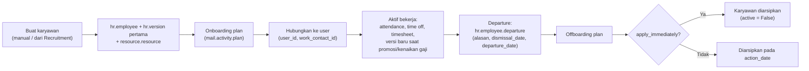

```mermaid
flowchart LR
    A["Buat karyawan<br/>(manual / dari Recruitment)"] --> B["hr.employee + hr.version pertama<br/>+ resource.resource"]
    B --> C["Onboarding plan<br/>(mail.activity.plan)"]
    C --> D["Hubungkan ke user<br/>(user_id, work_contact_id)"]
    D --> E["Aktif bekerja:<br/>attendance, time off, timesheet,<br/>versi baru saat promosi/kenaikan gaji"]
    E --> F["Departure:<br/>hr.employee.departure<br/>(alasan, dismissal_date, departure_date)"]
    F --> G["Offboarding plan"]
    G --> H{"apply_immediately?"}
    H -- Ya --> I["Karyawan diarsipkan<br/>(active = False)"]
    H -- Tidak --> J["Diarsipkan pada action_date"]
```

---

_Sumber: dokumentasi_hr_odoo.md §4_
