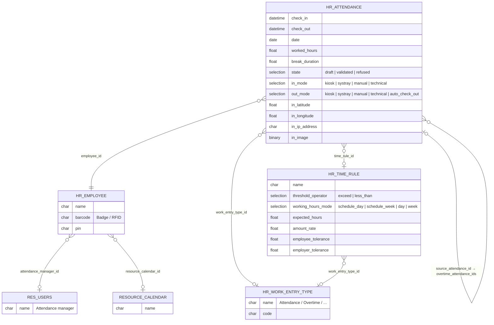

```mermaid
erDiagram
    HR_ATTENDANCE {
        datetime check_in
        datetime check_out
        date date
        float worked_hours
        float break_duration
        selection state "draft | validated | refused"
        selection in_mode "kiosk | systray | manual | technical"
        selection out_mode "kiosk | systray | manual | technical | auto_check_out"
        float in_latitude
        float in_longitude
        char in_ip_address
        binary in_image
    }
    HR_EMPLOYEE {
        char name
        char barcode "Badge / RFID"
        char pin
    }
    HR_TIME_RULE {
        char name
        selection threshold_operator "exceed | less_than"
        selection working_hours_mode "schedule_day | schedule_week | day | week"
        float expected_hours
        float amount_rate
        float employee_tolerance
        float employer_tolerance
    }
    HR_WORK_ENTRY_TYPE {
        char name "Attendance / Overtime / ..."
        char code
    }
    RES_USERS {
        char name "Attendance manager"
    }
    RESOURCE_CALENDAR {
        char name
    }

    HR_ATTENDANCE }o--|| HR_EMPLOYEE : employee_id
    HR_ATTENDANCE }o--o| HR_WORK_ENTRY_TYPE : work_entry_type_id
    HR_ATTENDANCE }o--o| HR_TIME_RULE : time_rule_id
    HR_ATTENDANCE |o--o{ HR_ATTENDANCE : "source_attendance_id → overtime_attendance_ids"
    HR_EMPLOYEE }o--o| RES_USERS : attendance_manager_id
    HR_EMPLOYEE }o--o| RESOURCE_CALENDAR : resource_calendar_id
    HR_TIME_RULE }o--o| HR_WORK_ENTRY_TYPE : work_entry_type_id
```

---

_Sumber: dokumentasi_hr_odoo.md §5_
