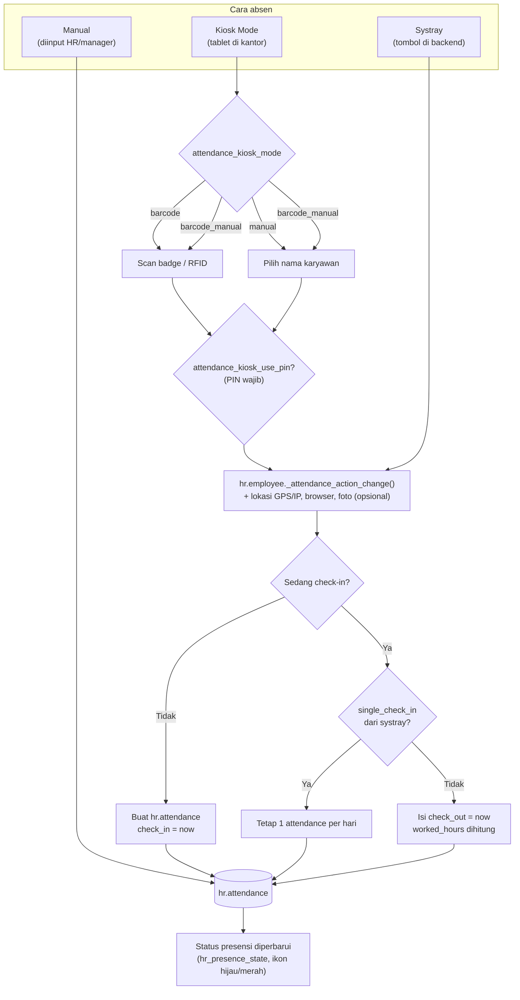

```mermaid
flowchart TB
    subgraph SRC["Cara absen"]
        direction LR
        K["Kiosk Mode<br/>(tablet di kantor)"]
        S["Systray<br/>(tombol di backend)"]
        M["Manual<br/>(diinput HR/manager)"]
    end

    K --> K1{"attendance_kiosk_mode"}
    K1 -- barcode --> K2["Scan badge / RFID"]
    K1 -- manual --> K3["Pilih nama karyawan"]
    K1 -- barcode_manual --> K2
    K1 -- barcode_manual --> K3
    K2 --> PIN{"attendance_kiosk_use_pin?<br/>(PIN wajib)"}
    K3 --> PIN
    PIN --> ACT
    S --> ACT["hr.employee._attendance_action_change()<br/>+ lokasi GPS/IP, browser, foto (opsional)"]
    M --> REC

    ACT --> Q{"Sedang check-in?"}
    Q -- Tidak --> CI["Buat hr.attendance<br/>check_in = now"]
    Q -- Ya --> SG{"single_check_in<br/>dari systray?"}
    SG -- Ya --> CI2["Tetap 1 attendance per hari"]
    SG -- Tidak --> CO["Isi check_out = now<br/>worked_hours dihitung"]
    CI --> REC[("hr.attendance")]
    CI2 --> REC
    CO --> REC
    REC --> BUS["Status presensi diperbarui<br/>(hr_presence_state, ikon hijau/merah)"]
```

---

_Sumber: dokumentasi_hr_odoo.md §6_
