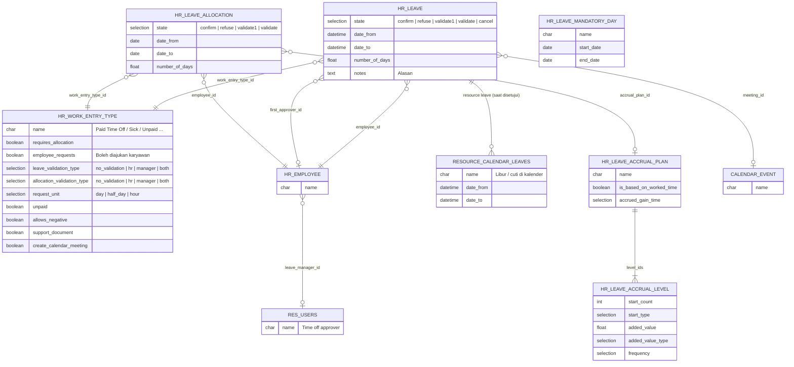

```mermaid
erDiagram
    HR_WORK_ENTRY_TYPE {
        char name "Paid Time Off / Sick / Unpaid ..."
        boolean requires_allocation
        boolean employee_requests "Boleh diajukan karyawan"
        selection leave_validation_type "no_validation | hr | manager | both"
        selection allocation_validation_type "no_validation | hr | manager | both"
        selection request_unit "day | half_day | hour"
        boolean unpaid
        boolean allows_negative
        boolean support_document
        boolean create_calendar_meeting
    }
    HR_LEAVE {
        selection state "confirm | refuse | validate1 | validate | cancel"
        datetime date_from
        datetime date_to
        float number_of_days
        text notes "Alasan"
    }
    HR_LEAVE_ALLOCATION {
        selection state "confirm | refuse | validate1 | validate"
        date date_from
        date date_to
        float number_of_days
    }
    HR_LEAVE_ACCRUAL_PLAN {
        char name
        boolean is_based_on_worked_time
        selection accrued_gain_time
    }
    HR_LEAVE_ACCRUAL_LEVEL {
        int start_count
        selection start_type
        float added_value
        selection added_value_type
        selection frequency
    }
    HR_LEAVE_MANDATORY_DAY {
        char name
        date start_date
        date end_date
    }
    RESOURCE_CALENDAR_LEAVES {
        char name "Libur / cuti di kalender"
        datetime date_from
        datetime date_to
    }
    HR_EMPLOYEE {
        char name
    }
    RES_USERS {
        char name "Time off approver"
    }
    CALENDAR_EVENT {
        char name
    }

    HR_LEAVE }o--|| HR_EMPLOYEE : employee_id
    HR_LEAVE }o--|| HR_WORK_ENTRY_TYPE : work_entry_type_id
    HR_LEAVE }o--o| CALENDAR_EVENT : meeting_id
    HR_LEAVE ||--o{ RESOURCE_CALENDAR_LEAVES : "resource leave (saat disetujui)"
    HR_LEAVE }o--o| HR_EMPLOYEE : first_approver_id
    HR_LEAVE_ALLOCATION }o--|| HR_EMPLOYEE : employee_id
    HR_LEAVE_ALLOCATION }o--|| HR_WORK_ENTRY_TYPE : work_entry_type_id
    HR_LEAVE_ALLOCATION }o--o| HR_LEAVE_ACCRUAL_PLAN : accrual_plan_id
    HR_LEAVE_ACCRUAL_PLAN ||--|{ HR_LEAVE_ACCRUAL_LEVEL : level_ids
    HR_EMPLOYEE }o--o| RES_USERS : leave_manager_id
```

---

_Sumber: dokumentasi_hr_odoo.md §8_
