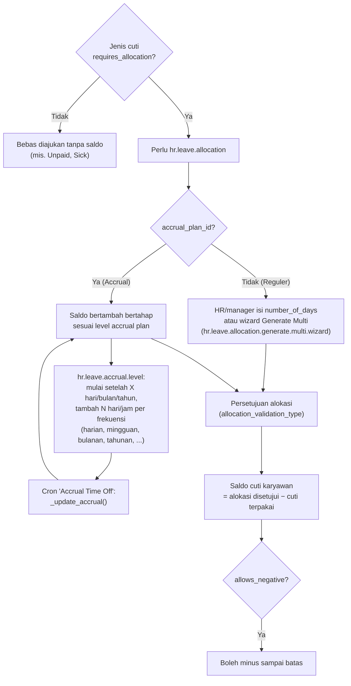

```mermaid
flowchart TB
    A{"Jenis cuti<br/>requires_allocation?"}
    A -- Tidak --> N["Bebas diajukan tanpa saldo<br/>(mis. Unpaid, Sick)"]
    A -- Ya --> B["Perlu hr.leave.allocation"]
    B --> C{"accrual_plan_id?"}
    C -- "Tidak (Reguler)" --> R["HR/manager isi number_of_days<br/>atau wizard Generate Multi<br/>(hr.leave.allocation.generate.multi.wizard)"]
    C -- "Ya (Accrual)" --> AC["Saldo bertambah bertahap<br/>sesuai level accrual plan"]
    AC --> L["hr.leave.accrual.level:<br/>mulai setelah X hari/bulan/tahun,<br/>tambah N hari/jam per frekuensi<br/>(harian, mingguan, bulanan, tahunan, ...)"]
    L --> CR["Cron 'Accrual Time Off':<br/>_update_accrual()"]
    CR --> AC
    R --> V["Persetujuan alokasi<br/>(allocation_validation_type)"]
    AC --> V
    V --> S["Saldo cuti karyawan<br/>= alokasi disetujui − cuti terpakai"]
    S --> NEG{"allows_negative?"}
    NEG -- Ya --> NEG1["Boleh minus sampai batas"]
```

---

_Sumber: dokumentasi_hr_odoo.md §9_
