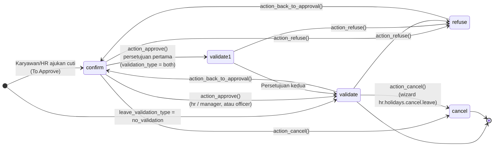
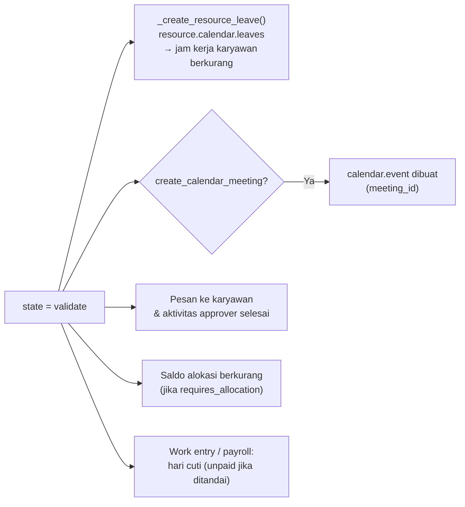

```mermaid
stateDiagram-v2
    direction LR
    [*] --> confirm : Karyawan/HR ajukan cuti<br/>(To Approve)
    [*] --> validate : leave_validation_type = no_validation
    confirm --> validate1 : action_approve()<br/>persetujuan pertama<br/>(validation_type = both)
    confirm --> validate : action_approve()<br/>(hr / manager, atau officer)
    validate1 --> validate : Persetujuan kedua
    confirm --> refuse : action_refuse()
    validate1 --> refuse : action_refuse()
    validate --> refuse : action_refuse()
    refuse --> confirm : action_back_to_approval()
    validate --> confirm : action_back_to_approval()
    confirm --> cancel : action_cancel()
    validate --> cancel : action_cancel()<br/>(wizard hr.holidays.cancel.leave)
    validate --> [*]
    cancel --> [*]
```

Efek saat cuti **disetujui** (`_validate_leave_request`):

```mermaid
flowchart LR
    A["state = validate"] --> B["_create_resource_leave()<br/>resource.calendar.leaves<br/>→ jam kerja karyawan berkurang"]
    A --> C{"create_calendar_meeting?"}
    C -- Ya --> C1["calendar.event dibuat<br/>(meeting_id)"]
    A --> D["Pesan ke karyawan<br/>& aktivitas approver selesai"]
    A --> E["Saldo alokasi berkurang<br/>(jika requires_allocation)"]
    A --> F["Work entry / payroll:<br/>hari cuti (unpaid jika ditandai)"]
```

---

_Sumber: dokumentasi_hr_odoo.md §10_
