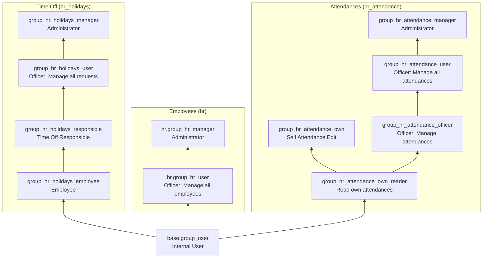

```mermaid
flowchart BT
    U["base.group_user<br/>Internal User"]

    subgraph EMP["Employees (hr)"]
        H1["hr.group_hr_user<br/>Officer: Manage all employees"]
        H2["hr.group_hr_manager<br/>Administrator"]
        H1 --> H2
    end

    subgraph ATT["Attendances (hr_attendance)"]
        A0["group_hr_attendance_own_reader<br/>Read own attendances"]
        A1["group_hr_attendance_own<br/>Self Attendance Edit"]
        A2["group_hr_attendance_officer<br/>Officer: Manage attendances"]
        A3["group_hr_attendance_user<br/>Officer: Manage all attendances"]
        A4["group_hr_attendance_manager<br/>Administrator"]
        A0 --> A1
        A0 --> A2 --> A3 --> A4
    end

    subgraph HOL["Time Off (hr_holidays)"]
        L0["group_hr_holidays_employee<br/>Employee"]
        L1["group_hr_holidays_responsible<br/>Time Off Responsible"]
        L2["group_hr_holidays_user<br/>Officer: Manage all requests"]
        L3["group_hr_holidays_manager<br/>Administrator"]
        L0 --> L1 --> L2 --> L3
    end

    U --> H1
    U --> A0
    U --> L0
```

Diagram di atas menyederhanakan hubungan antar grup. Detail `implied_ids` ada di file security masing-masing modul.

---

_Sumber: dokumentasi_hr_odoo.md §13_
