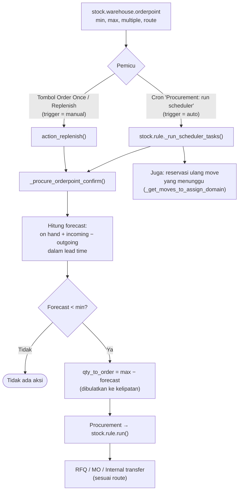

```mermaid
flowchart TB
    A["stock.warehouse.orderpoint<br/>min, max, multiple, route"] --> B{"Pemicu"}
    B -- "Cron 'Procurement: run scheduler'<br/>(trigger = auto)" --> C["stock.rule._run_scheduler_tasks()"]
    B -- "Tombol Order Once / Replenish<br/>(trigger = manual)" --> D["action_replenish()"]
    C --> E["_procure_orderpoint_confirm()"]
    D --> E
    E --> F["Hitung forecast:<br/>on hand + incoming − outgoing<br/>dalam lead time"]
    F --> G{"Forecast < min?"}
    G -- Tidak --> H(["Tidak ada aksi"])
    G -- Ya --> I["qty_to_order = max − forecast<br/>(dibulatkan ke kelipatan)"]
    I --> J["Procurement → stock.rule.run()"]
    J --> K["RFQ / MO / Internal transfer<br/>(sesuai route)"]
    C --> L["Juga: reservasi ulang move<br/>yang menunggu (_get_moves_to_assign_domain)"]
```

Halaman **Replenishment** juga otomatis membuat orderpoint manual (min = max = 0) untuk produk yang forecast-nya negatif.

---

_Sumber: dokumentasi_inventory_odoo.md §8_
