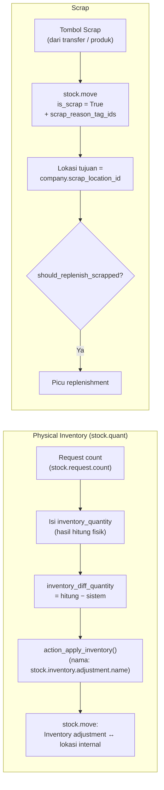

```mermaid
flowchart LR
    subgraph ADJ["Physical Inventory (stock.quant)"]
        direction TB
        A1["Request count<br/>(stock.request.count)"] --> A2["Isi inventory_quantity<br/>(hasil hitung fisik)"]
        A2 --> A3["inventory_diff_quantity<br/>= hitung − sistem"]
        A3 --> A4["action_apply_inventory()<br/>(nama: stock.inventory.adjustment.name)"]
        A4 --> A5["stock.move:<br/>Inventory adjustment ↔ lokasi internal"]
    end

    subgraph SCR["Scrap"]
        direction TB
        S1["Tombol Scrap<br/>(dari transfer / produk)"] --> S2["stock.move<br/>is_scrap = True<br/>+ scrap_reason_tag_ids"]
        S2 --> S3["Lokasi tujuan =<br/>company.scrap_location_id"]
        S3 --> S4{"should_replenish_scrapped?"}
        S4 -- Ya --> S5["Picu replenishment"]
    end
```

---

_Sumber: dokumentasi_inventory_odoo.md §9_
