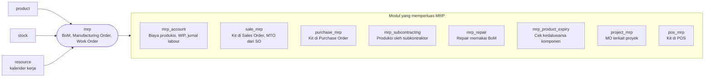

Modul `mrp` bergantung pada `product`, `stock`, dan `resource` (kalender kerja work center). Nilai biaya produksi ditambahkan oleh `mrp_account`.

```mermaid
flowchart LR
    product["product"] --> MRP(["mrp<br/>BoM, Manufacturing Order, Work Order"])
    stock["stock"] --> MRP
    resource["resource<br/>kalender kerja"] --> MRP

    subgraph EXT["Modul yang memperluas MRP"]
        direction TB
        mrp_account["mrp_account<br/>Biaya produksi, WIP, jurnal labour"]
        sale_mrp["sale_mrp<br/>Kit di Sales Order, MTO dari SO"]
        purchase_mrp["purchase_mrp<br/>Kit di Purchase Order"]
        mrp_subcontracting["mrp_subcontracting<br/>Produksi oleh subkontraktor"]
        mrp_repair["mrp_repair<br/>Repair memakai BoM"]
        mrp_product_expiry["mrp_product_expiry<br/>Cek kedaluwarsa komponen"]
        project_mrp["project_mrp<br/>MO terkait proyek"]
        pos_mrp["pos_mrp<br/>Kit di POS"]
    end

    MRP --> EXT
```

---

_Sumber: dokumentasi_mrp_odoo.md §1_
