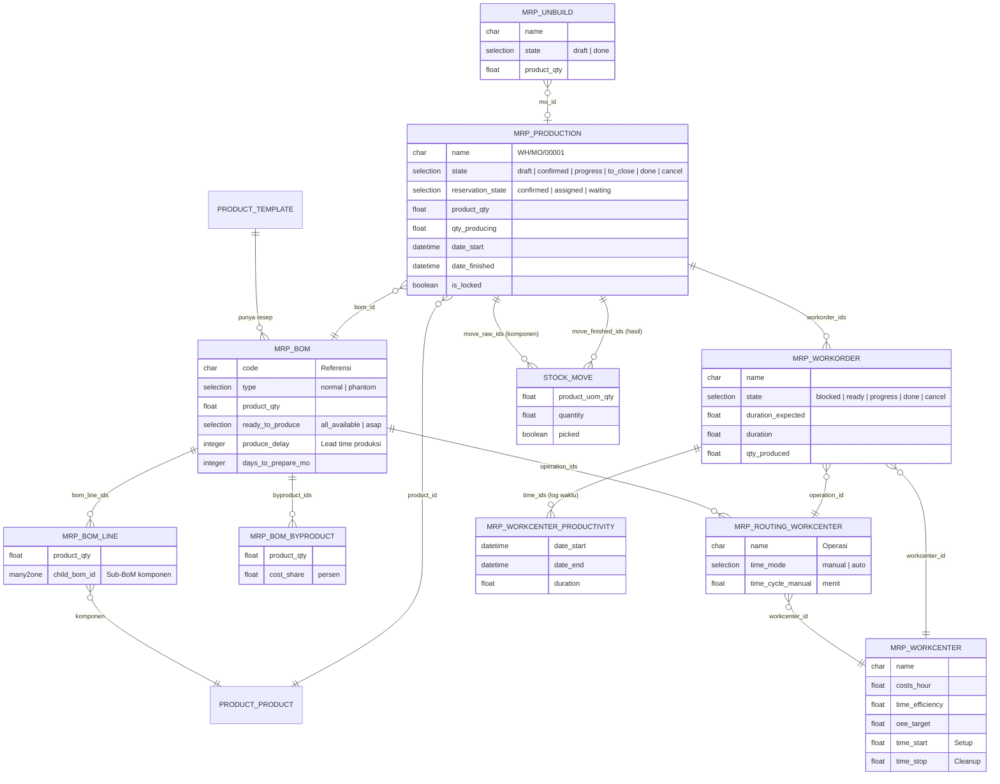

```mermaid
erDiagram
    MRP_BOM {
        char code "Referensi"
        selection type "normal | phantom"
        float product_qty
        selection ready_to_produce "all_available | asap"
        integer produce_delay "Lead time produksi"
        integer days_to_prepare_mo
    }
    MRP_BOM_LINE {
        float product_qty
        many2one child_bom_id "Sub-BoM komponen"
    }
    MRP_BOM_BYPRODUCT {
        float product_qty
        float cost_share "persen"
    }
    MRP_ROUTING_WORKCENTER {
        char name "Operasi"
        selection time_mode "manual | auto"
        float time_cycle_manual "menit"
    }
    MRP_WORKCENTER {
        char name
        float costs_hour
        float time_efficiency
        float oee_target
        float time_start "Setup"
        float time_stop "Cleanup"
    }
    MRP_PRODUCTION {
        char name "WH/MO/00001"
        selection state "draft | confirmed | progress | to_close | done | cancel"
        selection reservation_state "confirmed | assigned | waiting"
        float product_qty
        float qty_producing
        datetime date_start
        datetime date_finished
        boolean is_locked
    }
    MRP_WORKORDER {
        char name
        selection state "blocked | ready | progress | done | cancel"
        float duration_expected
        float duration
        float qty_produced
    }
    MRP_WORKCENTER_PRODUCTIVITY {
        datetime date_start
        datetime date_end
        float duration
    }
    STOCK_MOVE {
        float product_uom_qty
        float quantity
        boolean picked
    }
    MRP_UNBUILD {
        char name
        selection state "draft | done"
        float product_qty
    }

    PRODUCT_TEMPLATE ||--o{ MRP_BOM : "punya resep"
    MRP_BOM ||--o{ MRP_BOM_LINE : bom_line_ids
    MRP_BOM ||--o{ MRP_BOM_BYPRODUCT : byproduct_ids
    MRP_BOM ||--o{ MRP_ROUTING_WORKCENTER : operation_ids
    MRP_BOM_LINE }o--|| PRODUCT_PRODUCT : "komponen"
    MRP_ROUTING_WORKCENTER }o--|| MRP_WORKCENTER : workcenter_id
    MRP_PRODUCTION }o--|| MRP_BOM : bom_id
    MRP_PRODUCTION }o--|| PRODUCT_PRODUCT : product_id
    MRP_PRODUCTION ||--o{ STOCK_MOVE : "move_raw_ids (komponen)"
    MRP_PRODUCTION ||--o{ STOCK_MOVE : "move_finished_ids (hasil)"
    MRP_PRODUCTION ||--o{ MRP_WORKORDER : workorder_ids
    MRP_WORKORDER }o--|| MRP_ROUTING_WORKCENTER : operation_id
    MRP_WORKORDER }o--|| MRP_WORKCENTER : workcenter_id
    MRP_WORKORDER ||--o{ MRP_WORKCENTER_PRODUCTIVITY : "time_ids (log waktu)"
    MRP_UNBUILD }o--o| MRP_PRODUCTION : mo_id
```

---

_Sumber: dokumentasi_mrp_odoo.md §2_
