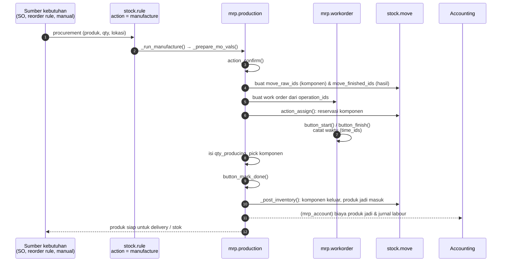

```mermaid
sequenceDiagram
    autonumber
    participant SRC as Sumber kebutuhan<br/>(SO, reorder rule, manual)
    participant RULE as stock.rule<br/>action = manufacture
    participant MO as mrp.production
    participant WO as mrp.workorder
    participant STK as stock.move
    participant ACC as Accounting

    SRC->>RULE: procurement (produk, qty, lokasi)
    RULE->>MO: _run_manufacture() → _prepare_mo_vals()
    MO->>MO: action_confirm()
    MO->>STK: buat move_raw_ids (komponen) & move_finished_ids (hasil)
    MO->>WO: buat work order dari operation_ids
    MO->>STK: action_assign(): reservasi komponen
    WO->>WO: button_start() / button_finish()<br/>catat waktu (time_ids)
    MO->>MO: isi qty_producing, pick komponen
    MO->>MO: button_mark_done()
    MO->>STK: _post_inventory(): komponen keluar, produk jadi masuk
    MO-->>ACC: (mrp_account) biaya produk jadi & jurnal labour
    MO-->>SRC: produk siap untuk delivery / stok
```

---

_Sumber: dokumentasi_mrp_odoo.md §5_
