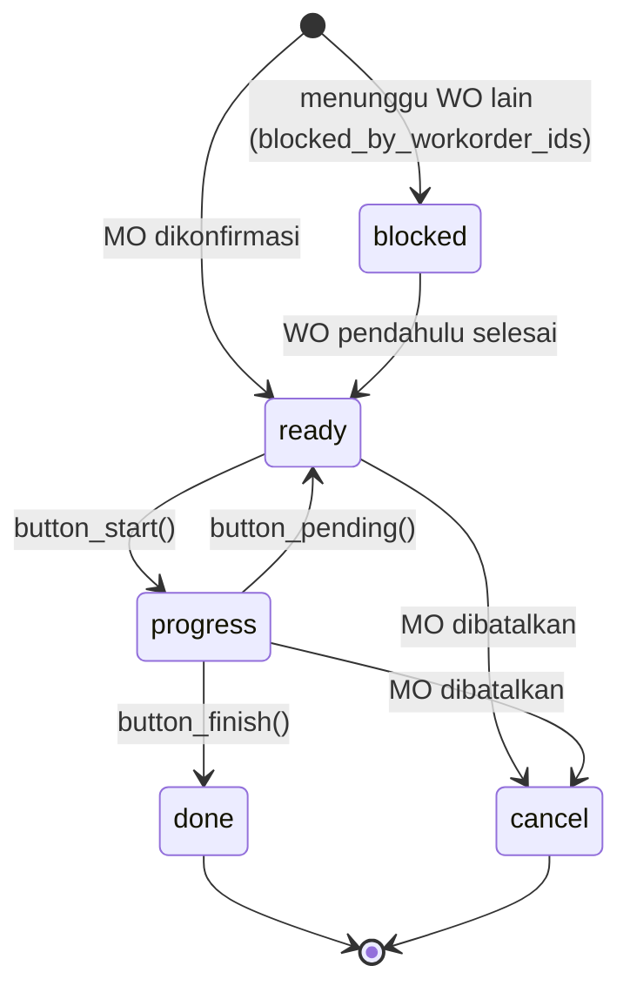
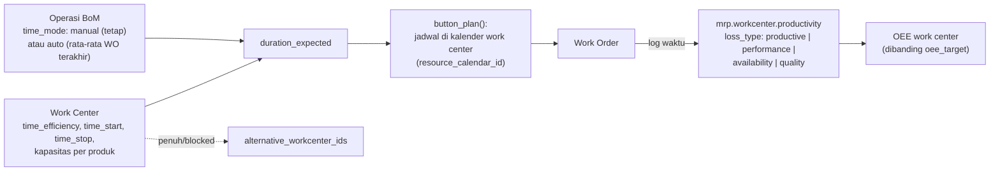

Work order dibuat dari **operasi** di BoM (`mrp.routing.workcenter`) jika grup `mrp.group_mrp_routings` (MRP Work Orders) aktif.

```mermaid
stateDiagram-v2
    [*] --> ready : MO dikonfirmasi
    [*] --> blocked : menunggu WO lain (blocked_by_workorder_ids)
    blocked --> ready : WO pendahulu selesai
    ready --> progress : button_start()
    progress --> ready : button_pending()
    progress --> done : button_finish()
    ready --> cancel : MO dibatalkan
    progress --> cancel : MO dibatalkan
    done --> [*]
    cancel --> [*]
```

```mermaid
flowchart LR
    OP["Operasi BoM<br/>time_mode: manual (tetap)<br/>atau auto (rata-rata WO terakhir)"] --> DUR["duration_expected"]
    WC["Work Center<br/>time_efficiency, time_start, time_stop,<br/>kapasitas per produk"] --> DUR
    DUR --> PLAN["button_plan():<br/>jadwal di kalender work center<br/>(resource_calendar_id)"]
    PLAN --> WO["Work Order"]
    WO -->|"log waktu"| PROD["mrp.workcenter.productivity<br/>loss_type: productive | performance |<br/>availability | quality"]
    PROD --> OEE["OEE work center<br/>(dibanding oee_target)"]
    WC -.->|"penuh/blocked"| ALT["alternative_workcenter_ids"]
```

---

_Sumber: dokumentasi_mrp_odoo.md §6_
