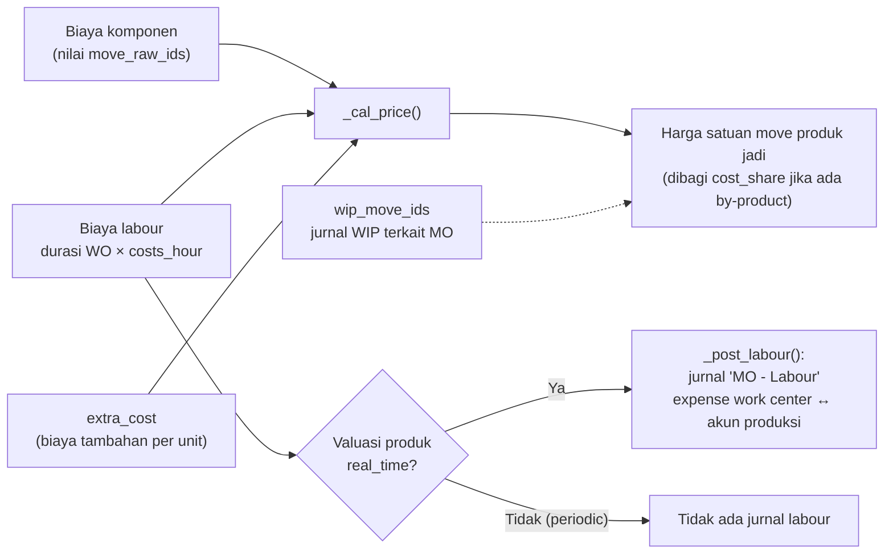

```mermaid
flowchart LR
    COMP["Biaya komponen<br/>(nilai move_raw_ids)"] --> CP["_cal_price()"]
    LAB["Biaya labour<br/>durasi WO × costs_hour"] --> CP
    EXTRA["extra_cost<br/>(biaya tambahan per unit)"] --> CP
    CP --> FIN["Harga satuan move produk jadi<br/>(dibagi cost_share jika ada by-product)"]

    LAB --> PL{"Valuasi produk<br/>real_time?"}
    PL -- "Ya" --> JE["_post_labour():<br/>jurnal 'MO - Labour'<br/>expense work center ↔ akun produksi"]
    PL -- "Tidak (periodic)" --> SKIP["Tidak ada jurnal labour"]
    WIP["wip_move_ids<br/>jurnal WIP terkait MO"] -.-> FIN
```

---

_Sumber: dokumentasi_mrp_odoo.md §9_
