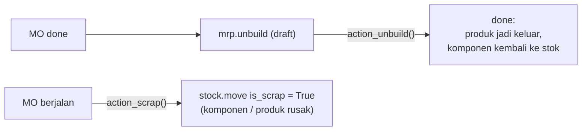

```mermaid
flowchart LR
    MOD["MO done"] --> UB["mrp.unbuild (draft)"]
    UB -->|"action_unbuild()"| UD["done:<br/>produk jadi keluar,<br/>komponen kembali ke stok"]
    MO2["MO berjalan"] -->|"action_scrap()"| SC["stock.move is_scrap = True<br/>(komponen / produk rusak)"]
```

---

_Sumber: dokumentasi_mrp_odoo.md §10_
