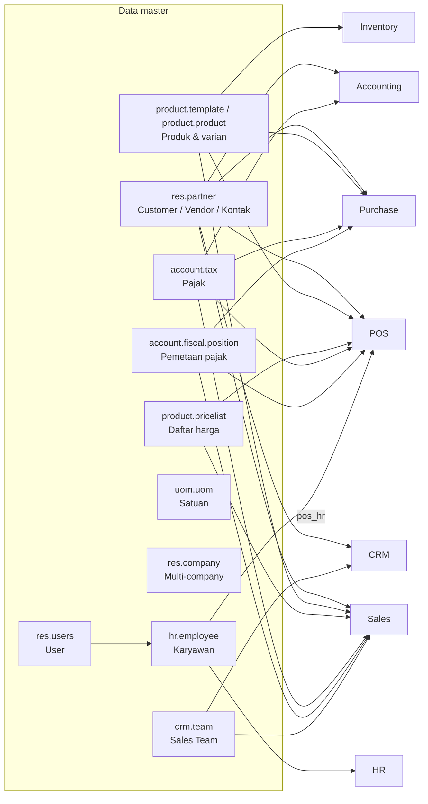

Semua modul memakai data master yang sama, sehingga customer, produk, dan pajak cukup dibuat sekali.

```mermaid
flowchart LR
    subgraph MASTER["Data master"]
        direction TB
        partner["res.partner<br/>Customer / Vendor / Kontak"]
        prod["product.template / product.product<br/>Produk & varian"]
        pricelist["product.pricelist<br/>Daftar harga"]
        tax["account.tax<br/>Pajak"]
        fpos["account.fiscal.position<br/>Pemetaan pajak"]
        uom["uom.uom<br/>Satuan"]
        company["res.company<br/>Multi-company"]
        users["res.users<br/>User"]
        team["crm.team<br/>Sales Team"]
        emp["hr.employee<br/>Karyawan"]
    end

    partner --> CRM["CRM"]
    partner --> SALE["Sales"]
    partner --> PUR["Purchase"]
    partner --> POS["POS"]
    partner --> ACC["Accounting"]
    prod --> SALE
    prod --> PUR
    prod --> POS
    prod --> STK["Inventory"]
    pricelist --> SALE
    pricelist --> POS
    tax --> SALE
    tax --> PUR
    tax --> POS
    tax --> ACC
    fpos --> SALE
    fpos --> PUR
    fpos --> POS
    team --> CRM
    team --> SALE
    users --> emp
    emp --> HR["HR"]
    emp -->|"pos_hr"| POS
```

---

_Sumber: dokumentasi_overview_odoo.md §2_
