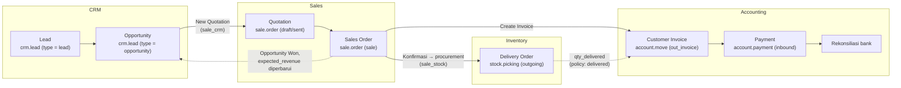

```mermaid
flowchart LR
    subgraph C["CRM"]
        L1["Lead<br/>crm.lead (type = lead)"] --> L2["Opportunity<br/>crm.lead (type = opportunity)"]
    end
    subgraph S["Sales"]
        Q["Quotation<br/>sale.order (draft/sent)"] --> SO["Sales Order<br/>sale.order (sale)"]
    end
    subgraph I["Inventory"]
        DO["Delivery Order<br/>stock.picking (outgoing)"]
    end
    subgraph A["Accounting"]
        INV["Customer Invoice<br/>account.move (out_invoice)"] --> PAY["Payment<br/>account.payment (inbound)"]
        PAY --> REC["Rekonsiliasi bank"]
    end

    L2 -->|"New Quotation<br/>(sale_crm)"| Q
    SO -->|"Konfirmasi → procurement<br/>(sale_stock)"| DO
    SO -->|"Create Invoice"| INV
    DO -.->|"qty_delivered<br/>(policy: delivered)"| INV
    SO -.->|"Opportunity Won,<br/>expected_revenue diperbarui"| L2
```

Detail: CRM bagian 3 & 5, Sales bagian 4–9, Inventory bagian 5–7, Accounting bagian 6–8.

---

_Sumber: dokumentasi_overview_odoo.md §3_
