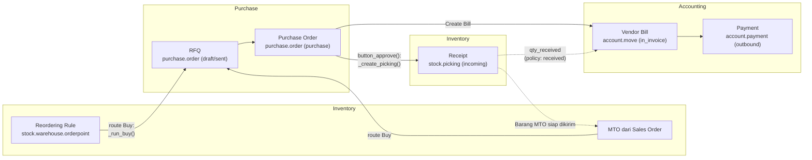

```mermaid
flowchart LR
    subgraph I1["Inventory"]
        OP["Reordering Rule<br/>stock.warehouse.orderpoint"]
        MTO["MTO dari Sales Order"]
    end
    subgraph P["Purchase"]
        RFQ["RFQ<br/>purchase.order (draft/sent)"] --> PO["Purchase Order<br/>purchase.order (purchase)"]
    end
    subgraph I2["Inventory"]
        RCV["Receipt<br/>stock.picking (incoming)"]
    end
    subgraph A["Accounting"]
        BILL["Vendor Bill<br/>account.move (in_invoice)"] --> PAY["Payment<br/>account.payment (outbound)"]
    end

    OP -->|"route Buy:<br/>_run_buy()"| RFQ
    MTO -->|"route Buy"| RFQ
    PO -->|"button_approve():<br/>_create_picking()"| RCV
    PO -->|"Create Bill"| BILL
    RCV -.->|"qty_received<br/>(policy: received)"| BILL
    RCV -.->|"Barang MTO siap dikirim"| MTO
```

Detail: Purchase bagian 3–8, Inventory bagian 7–8.

---

_Sumber: dokumentasi_overview_odoo.md §4_
