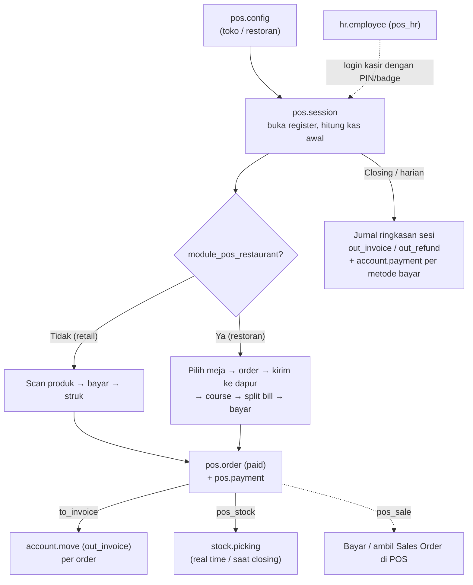

```mermaid
flowchart TB
    CFG["pos.config<br/>(toko / restoran)"] --> SES["pos.session<br/>buka register, hitung kas awal"]
    SES --> MODE{"module_pos_restaurant?"}
    MODE -- "Tidak (retail)" --> RT["Scan produk → bayar → struk"]
    MODE -- "Ya (restoran)" --> RS["Pilih meja → order → kirim ke dapur<br/>→ course → split bill → bayar"]
    RT --> ORD["pos.order (paid)<br/>+ pos.payment"]
    RS --> ORD

    ORD -->|"to_invoice"| INV["account.move (out_invoice)<br/>per order"]
    ORD -->|"pos_stock"| PK["stock.picking<br/>(real time / saat closing)"]
    SES -->|"Closing / harian"| JR["Jurnal ringkasan sesi<br/>out_invoice / out_refund<br/>+ account.payment per metode bayar"]
    ORD -.->|"pos_sale"| SO["Bayar / ambil Sales Order di POS"]
    EMP["hr.employee (pos_hr)"] -.->|"login kasir dengan PIN/badge"| SES
```

Detail: POS bagian 4–10, POS Restaurant bagian 3–9.

---

_Sumber: dokumentasi_overview_odoo.md §5_
