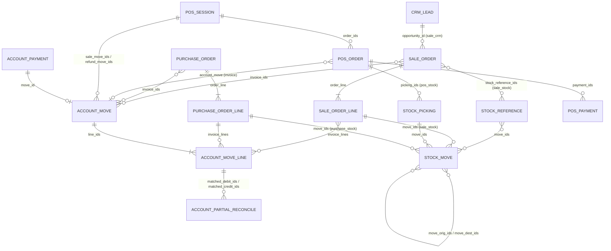

Penghubung antar dokumen (field yang menyimpan relasinya):

```mermaid
erDiagram
    CRM_LEAD ||--o{ SALE_ORDER : "opportunity_id (sale_crm)"
    SALE_ORDER ||--|{ SALE_ORDER_LINE : order_line
    SALE_ORDER }o--o{ ACCOUNT_MOVE : invoice_ids
    SALE_ORDER_LINE }o--o{ ACCOUNT_MOVE_LINE : invoice_lines
    SALE_ORDER }o--o{ STOCK_REFERENCE : "stock_reference_ids (sale_stock)"
    STOCK_REFERENCE }o--o{ STOCK_MOVE : move_ids
    SALE_ORDER_LINE ||--o{ STOCK_MOVE : "move_ids (sale_stock)"
    STOCK_PICKING ||--o{ STOCK_MOVE : move_ids
    STOCK_MOVE }o--o{ STOCK_MOVE : "move_orig_ids / move_dest_ids"
    PURCHASE_ORDER ||--|{ PURCHASE_ORDER_LINE : order_line
    PURCHASE_ORDER_LINE ||--o{ STOCK_MOVE : "move_ids (purchase_stock)"
    PURCHASE_ORDER_LINE ||--o{ ACCOUNT_MOVE_LINE : invoice_lines
    PURCHASE_ORDER }o--o{ ACCOUNT_MOVE : invoice_ids
    POS_SESSION ||--o{ POS_ORDER : order_ids
    POS_ORDER ||--o{ POS_PAYMENT : payment_ids
    POS_ORDER }o--o| ACCOUNT_MOVE : "account_move (invoice)"
    POS_SESSION ||--o{ ACCOUNT_MOVE : "sale_move_ids / refund_move_ids"
    POS_ORDER ||--o{ STOCK_PICKING : "picking_ids (pos_stock)"
    ACCOUNT_MOVE ||--|{ ACCOUNT_MOVE_LINE : line_ids
    ACCOUNT_PAYMENT ||--o| ACCOUNT_MOVE : move_id
    ACCOUNT_MOVE_LINE ||--o{ ACCOUNT_PARTIAL_RECONCILE : "matched_debit_ids / matched_credit_ids"
```

---

_Sumber: dokumentasi_overview_odoo.md §6_
