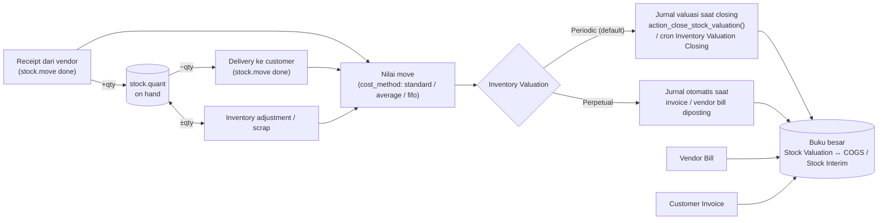

```mermaid
flowchart LR
    RCV["Receipt dari vendor<br/>(stock.move done)"] -->|"+qty"| Q[("stock.quant<br/>on hand")]
    Q -->|"−qty"| DLV["Delivery ke customer<br/>(stock.move done)"]
    Q <-->|"±qty"| ADJ["Inventory adjustment / scrap"]

    RCV --> VAL["Nilai move<br/>(cost_method: standard / average / fifo)"]
    DLV --> VAL
    ADJ --> VAL

    VAL --> MODE{"Inventory Valuation"}
    MODE -- "Periodic (default)" --> P1["Jurnal valuasi saat closing<br/>action_close_stock_valuation()<br/>/ cron Inventory Valuation Closing"]
    MODE -- "Perpetual" --> P2["Jurnal otomatis saat<br/>invoice / vendor bill diposting"]
    P1 --> GL[("Buku besar<br/>Stock Valuation ↔ COGS / Stock Interim")]
    P2 --> GL

    BILL["Vendor Bill"] --> GL
    INV["Customer Invoice"] --> GL
```

---

_Sumber: dokumentasi_overview_odoo.md §7_
