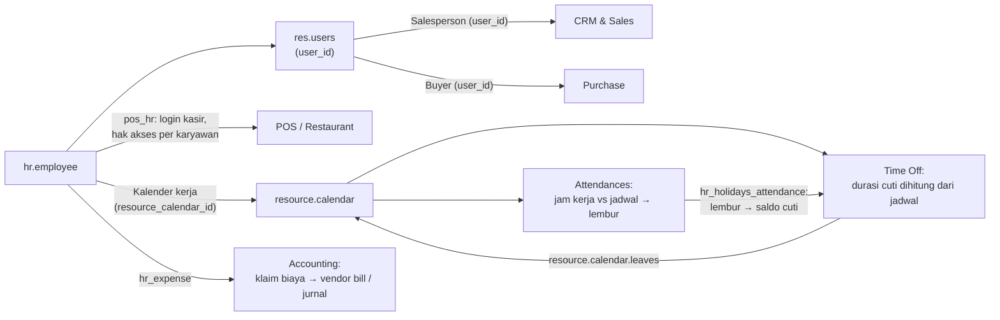

```mermaid
flowchart LR
    EMP["hr.employee"] --> U["res.users<br/>(user_id)"]
    U -->|"Salesperson (user_id)"| CRM["CRM & Sales"]
    U -->|"Buyer (user_id)"| PUR["Purchase"]
    EMP -->|"pos_hr: login kasir,<br/>hak akses per karyawan"| POS["POS / Restaurant"]
    EMP -->|"Kalender kerja<br/>(resource_calendar_id)"| CAL["resource.calendar"]
    CAL --> ATT["Attendances:<br/>jam kerja vs jadwal → lembur"]
    CAL --> HOL["Time Off:<br/>durasi cuti dihitung dari jadwal"]
    HOL -->|"resource.calendar.leaves"| CAL
    ATT -->|"hr_holidays_attendance:<br/>lembur → saldo cuti"| HOL
    EMP -->|"hr_expense"| ACC["Accounting:<br/>klaim biaya → vendor bill / jurnal"]
```

---

_Sumber: dokumentasi_overview_odoo.md §8_
