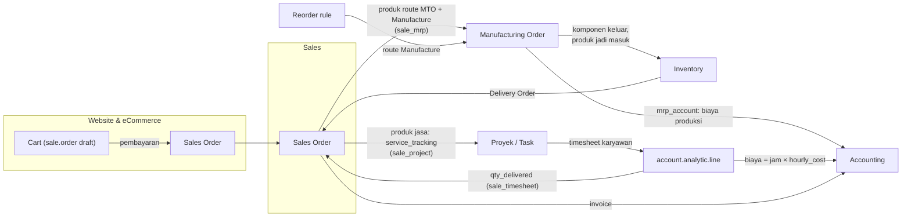

```mermaid
flowchart LR
    subgraph WEB["Website & eCommerce"]
        CART["Cart (sale.order draft)"] -->|"pembayaran"| WSO["Sales Order"]
    end
    subgraph SAL["Sales"]
        SO["Sales Order"]
    end
    WSO --> SO
    SO -->|"produk route MTO + Manufacture<br/>(sale_mrp)"| MO["Manufacturing Order"]
    OP["Reorder rule"] -->|"route Manufacture"| MO
    MO -->|"komponen keluar,<br/>produk jadi masuk"| STK["Inventory"]
    STK -->|"Delivery Order"| SO
    MO -->|"mrp_account: biaya produksi"| ACC["Accounting"]
    SO -->|"produk jasa: service_tracking<br/>(sale_project)"| PRJ["Proyek / Task"]
    PRJ -->|"timesheet karyawan"| TS["account.analytic.line"]
    TS -->|"qty_delivered (sale_timesheet)"| SO
    TS -->|"biaya = jam × hourly_cost"| ACC
    SO -->|"invoice"| ACC
```

---

_Sumber: dokumentasi_overview_odoo.md §9_
