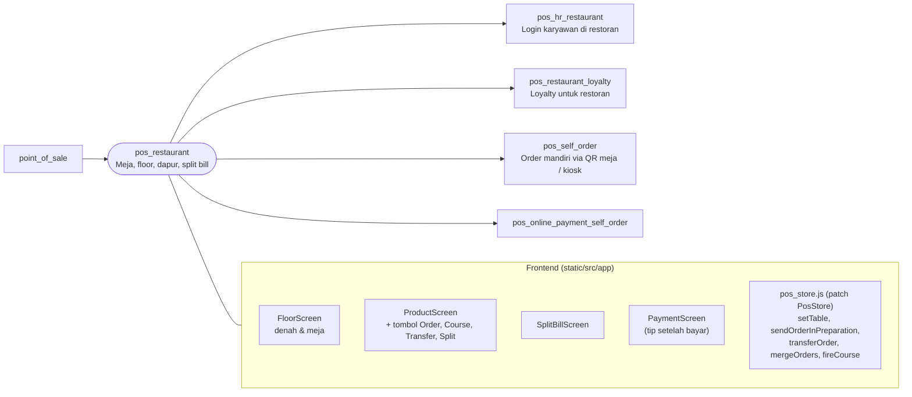

```mermaid
flowchart LR
    POS["point_of_sale"] --> RES(["pos_restaurant<br/>Meja, floor, dapur, split bill"])
    RES --> E1["pos_hr_restaurant<br/>Login karyawan di restoran"]
    RES --> E2["pos_restaurant_loyalty<br/>Loyalty untuk restoran"]
    RES --> E3["pos_self_order<br/>Order mandiri via QR meja / kiosk"]
    RES --> E4["pos_online_payment_self_order"]

    subgraph FE["Frontend (static/src/app)"]
        direction TB
        FS["FloorScreen<br/>denah & meja"]
        PS["ProductScreen<br/>+ tombol Order, Course, Transfer, Split"]
        SB["SplitBillScreen"]
        PAY["PaymentScreen<br/>(tip setelah bayar)"]
        STORE["pos_store.js (patch PosStore)<br/>setTable, sendOrderInPreparation,<br/>transferOrder, mergeOrders, fireCourse"]
    end
    RES --- FE
```

Konfigurasi restoran diaktifkan dengan `pos.config.module_pos_restaurant = True` ("Is a Bar/Restaurant").

---

_Sumber: dokumentasi_pos_restaurant_odoo.md §1_
