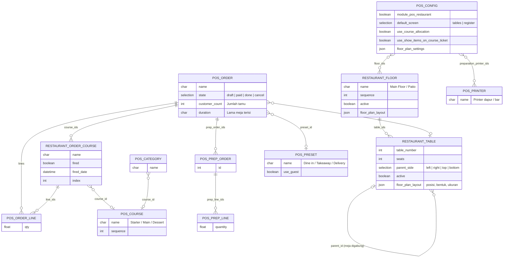

```mermaid
erDiagram
    POS_CONFIG {
        boolean module_pos_restaurant
        selection default_screen "tables | register"
        boolean use_course_allocation
        boolean use_show_items_on_course_ticket
        json floor_plan_settings
    }
    RESTAURANT_FLOOR {
        char name "Main Floor / Patio"
        int sequence
        boolean active
        json floor_plan_layout
    }
    RESTAURANT_TABLE {
        int table_number
        int seats
        selection parent_side "left | right | top | bottom"
        boolean active
        json floor_plan_layout "posisi, bentuk, ukuran"
    }
    POS_ORDER {
        char name
        selection state "draft | paid | done | cancel"
        int customer_count "Jumlah tamu"
        char duration "Lama meja terisi"
    }
    POS_ORDER_LINE {
        float qty
    }
    POS_COURSE {
        char name "Starter / Main / Dessert"
        int sequence
    }
    RESTAURANT_ORDER_COURSE {
        char name
        boolean fired
        datetime fired_date
        int index
    }
    POS_CATEGORY {
        char name
    }
    POS_PREP_ORDER {
        int id
    }
    POS_PREP_LINE {
        float quantity
    }
    POS_PRINTER {
        char name "Printer dapur / bar"
    }
    POS_PRESET {
        char name "Dine in / Takeaway / Delivery"
        boolean use_guest
    }

    POS_CONFIG }o--o{ RESTAURANT_FLOOR : floor_ids
    RESTAURANT_FLOOR ||--o{ RESTAURANT_TABLE : table_ids
    RESTAURANT_TABLE |o--o{ RESTAURANT_TABLE : "parent_id (meja digabung)"
    POS_ORDER }o--o| RESTAURANT_TABLE : table_id
    POS_ORDER ||--o{ POS_ORDER_LINE : lines
    POS_ORDER ||--o{ RESTAURANT_ORDER_COURSE : course_ids
    RESTAURANT_ORDER_COURSE }o--o| POS_COURSE : course_id
    RESTAURANT_ORDER_COURSE ||--o{ POS_ORDER_LINE : line_ids
    POS_CATEGORY }o--o| POS_COURSE : course_id
    POS_ORDER ||--o{ POS_PREP_ORDER : prep_order_ids
    POS_PREP_ORDER ||--o{ POS_PREP_LINE : prep_line_ids
    POS_CONFIG }o--o{ POS_PRINTER : preparation_printer_ids
    POS_ORDER }o--o| POS_PRESET : preset_id
```

---

_Sumber: dokumentasi_pos_restaurant_odoo.md §2_
