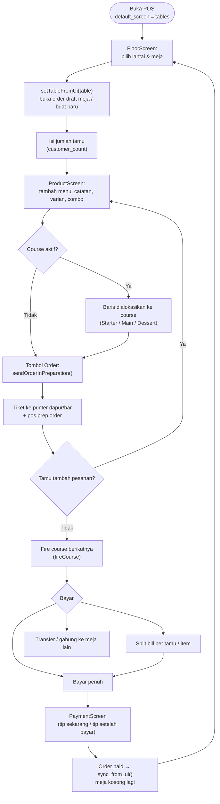

```mermaid
flowchart TB
    A(["Buka POS<br/>default_screen = tables"]) --> B["FloorScreen:<br/>pilih lantai & meja"]
    B --> C["setTableFromUi(table)<br/>buka order draft meja / buat baru"]
    C --> D["Isi jumlah tamu<br/>(customer_count)"]
    D --> E["ProductScreen:<br/>tambah menu, catatan, varian, combo"]
    E --> F{"Course aktif?"}
    F -- Ya --> F1["Baris dialokasikan ke course<br/>(Starter / Main / Dessert)"]
    F -- Tidak --> G
    F1 --> G["Tombol Order:<br/>sendOrderInPreparation()"]
    G --> H["Tiket ke printer dapur/bar<br/>+ pos.prep.order"]
    H --> I{"Tamu tambah pesanan?"}
    I -- Ya --> E
    I -- Tidak --> J["Fire course berikutnya<br/>(fireCourse)"]
    J --> K{"Bayar"}
    K --> K1["Bayar penuh"]
    K --> K2["Split bill per tamu / item"]
    K --> K3["Transfer / gabung ke meja lain"]
    K2 --> K1
    K1 --> L["PaymentScreen<br/>(tip sekarang / tip setelah bayar)"]
    L --> M["Order paid → sync_from_ui()<br/>meja kosong lagi"]
    M --> B
```

---

_Sumber: dokumentasi_pos_restaurant_odoo.md §3_
