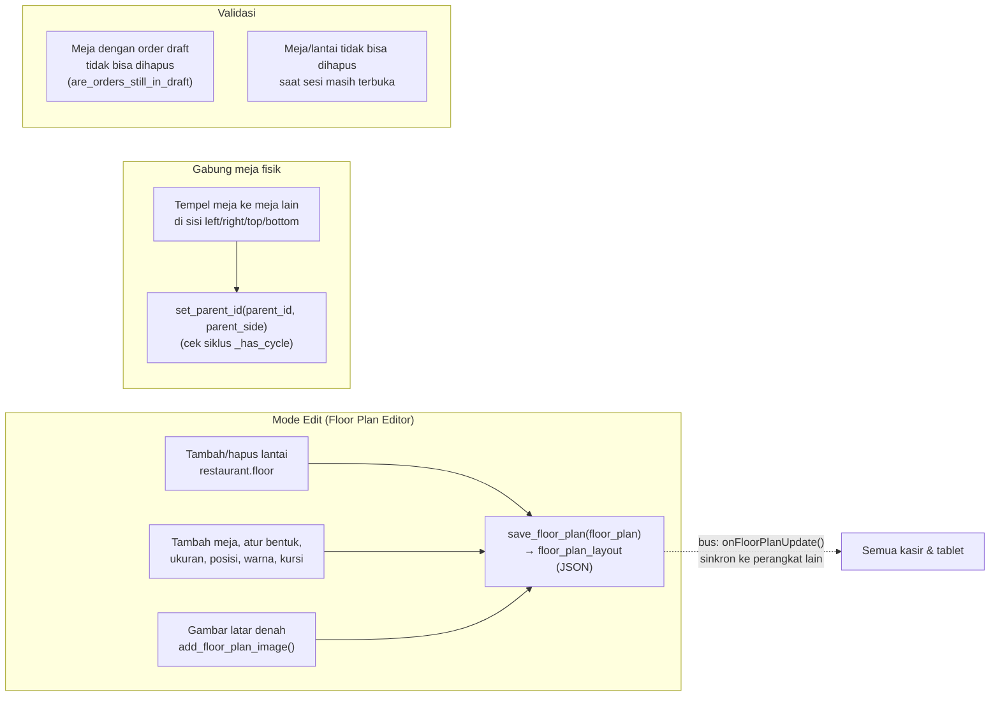

```mermaid
flowchart LR
    subgraph EDIT["Mode Edit (Floor Plan Editor)"]
        direction TB
        E1["Tambah/hapus lantai<br/>restaurant.floor"]
        E2["Tambah meja, atur bentuk,<br/>ukuran, posisi, warna, kursi"]
        E3["Gambar latar denah<br/>add_floor_plan_image()"]
        E4["save_floor_plan(floor_plan)<br/>→ floor_plan_layout (JSON)"]
        E1 --> E4
        E2 --> E4
        E3 --> E4
    end

    subgraph JOIN["Gabung meja fisik"]
        direction TB
        J1["Tempel meja ke meja lain<br/>di sisi left/right/top/bottom"]
        J2["set_parent_id(parent_id, parent_side)<br/>(cek siklus _has_cycle)"]
        J1 --> J2
    end

    subgraph GUARD["Validasi"]
        direction TB
        G1["Meja dengan order draft<br/>tidak bisa dihapus<br/>(are_orders_still_in_draft)"]
        G2["Meja/lantai tidak bisa dihapus<br/>saat sesi masih terbuka"]
    end

    E4 -. "bus: onFloorPlanUpdate()<br/>sinkron ke perangkat lain" .-> SYNC["Semua kasir & tablet"]
```

---

_Sumber: dokumentasi_pos_restaurant_odoo.md §4_
