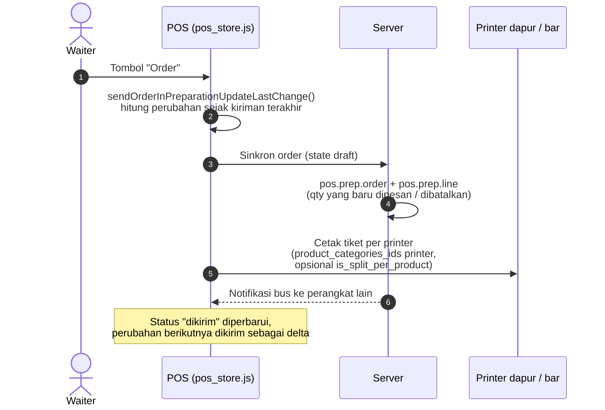

```mermaid
sequenceDiagram
    autonumber
    actor W as Waiter
    participant UI as POS (pos_store.js)
    participant S as Server
    participant PR as Printer dapur / bar

    W->>UI: Tombol "Order"
    UI->>UI: sendOrderInPreparationUpdateLastChange()<br/>hitung perubahan sejak kiriman terakhir
    UI->>S: Sinkron order (state draft)
    S->>S: pos.prep.order + pos.prep.line<br/>(qty yang baru dipesan / dibatalkan)
    UI->>PR: Cetak tiket per printer<br/>(product_categories_ids printer,<br/>opsional is_split_per_product)
    S-->>UI: Notifikasi bus ke perangkat lain
    Note over UI: Status "dikirim" diperbarui,<br/>perubahan berikutnya dikirim sebagai delta
```

---

_Sumber: dokumentasi_pos_restaurant_odoo.md §6_
