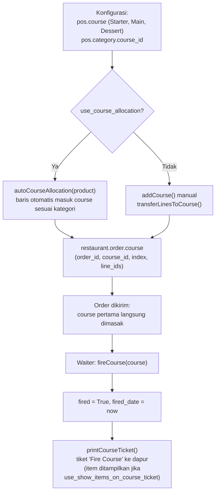

```mermaid
flowchart TB
    A["Konfigurasi:<br/>pos.course (Starter, Main, Dessert)<br/>pos.category.course_id"] --> B{"use_course_allocation?"}
    B -- Ya --> C["autoCourseAllocation(product)<br/>baris otomatis masuk course sesuai kategori"]
    B -- Tidak --> D["addCourse() manual<br/>transferLinesToCourse()"]
    C --> E["restaurant.order.course<br/>(order_id, course_id, index, line_ids)"]
    D --> E
    E --> F["Order dikirim:<br/>course pertama langsung dimasak"]
    F --> G["Waiter: fireCourse(course)"]
    G --> H["fired = True, fired_date = now"]
    H --> I["printCourseTicket()<br/>tiket 'Fire Course' ke dapur<br/>(item ditampilkan jika<br/>use_show_items_on_course_ticket)"]
```

---

_Sumber: dokumentasi_pos_restaurant_odoo.md §7_
