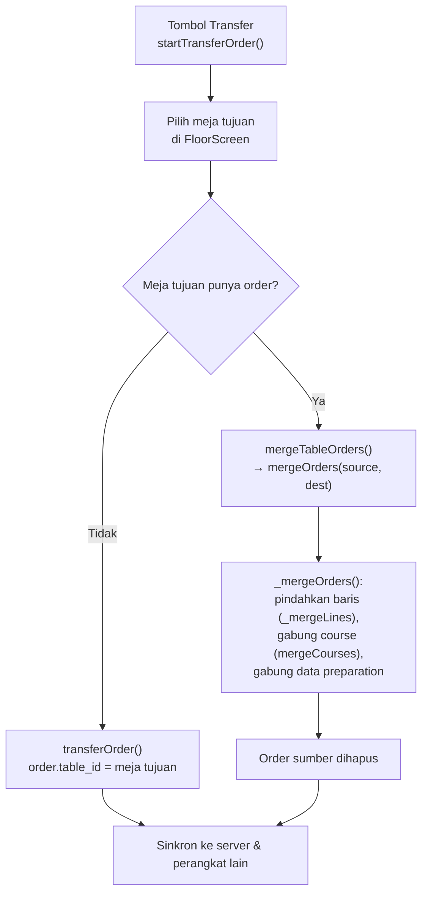

```mermaid
flowchart TB
    A["Tombol Transfer<br/>startTransferOrder()"] --> B["Pilih meja tujuan<br/>di FloorScreen"]
    B --> C{"Meja tujuan punya order?"}
    C -- Tidak --> D["transferOrder()<br/>order.table_id = meja tujuan"]
    C -- Ya --> E["mergeTableOrders()<br/>→ mergeOrders(source, dest)"]
    E --> F["_mergeOrders():<br/>pindahkan baris (_mergeLines),<br/>gabung course (mergeCourses),<br/>gabung data preparation"]
    F --> G["Order sumber dihapus"]
    D --> H["Sinkron ke server & perangkat lain"]
    G --> H
```

---

_Sumber: dokumentasi_pos_restaurant_odoo.md §8_
