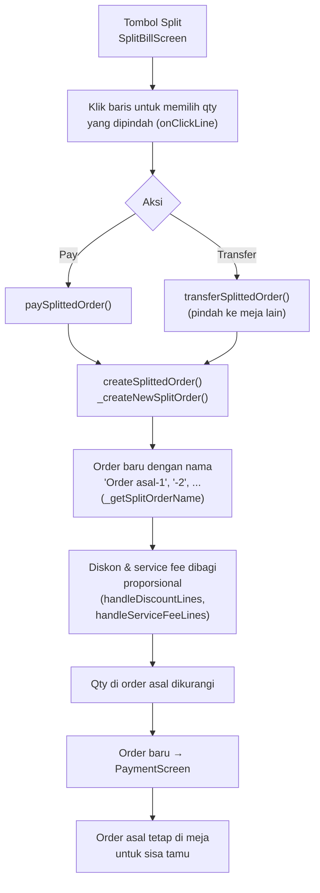

```mermaid
flowchart TB
    A["Tombol Split<br/>SplitBillScreen"] --> B["Klik baris untuk memilih qty<br/>yang dipindah (onClickLine)"]
    B --> C{"Aksi"}
    C -- "Pay" --> D["paySplittedOrder()"]
    C -- "Transfer" --> E["transferSplittedOrder()<br/>(pindah ke meja lain)"]
    D --> F["createSplittedOrder()<br/>_createNewSplitOrder()"]
    E --> F
    F --> G["Order baru dengan nama<br/>'Order asal-1', '-2', ...<br/>(_getSplitOrderName)"]
    G --> H["Diskon & service fee dibagi<br/>proporsional<br/>(handleDiscountLines,<br/>handleServiceFeeLines)"]
    H --> I["Qty di order asal dikurangi"]
    I --> J["Order baru → PaymentScreen"]
    J --> K["Order asal tetap di meja<br/>untuk sisa tamu"]
```

---

_Sumber: dokumentasi_pos_restaurant_odoo.md §9_
