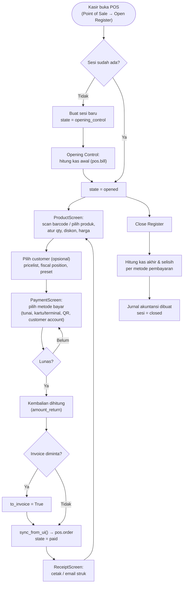

```mermaid
flowchart TB
    A(["Kasir buka POS<br/>(Point of Sale → Open Register)"]) --> B{"Sesi sudah ada?"}
    B -- Tidak --> C["Buat sesi baru<br/>state = opening_control"]
    C --> D["Opening Control:<br/>hitung kas awal (pos.bill)"]
    D --> E["state = opened"]
    B -- Ya --> E
    E --> F["ProductScreen:<br/>scan barcode / pilih produk,<br/>atur qty, diskon, harga"]
    F --> G["Pilih customer (opsional)<br/>pricelist, fiscal position, preset"]
    G --> H["PaymentScreen:<br/>pilih metode bayar<br/>(tunai, kartu/terminal, QR, customer account)"]
    H --> I{"Lunas?"}
    I -- Belum --> H
    I -- Ya --> J["Kembalian dihitung<br/>(amount_return)"]
    J --> K{"Invoice diminta?"}
    K -- Ya --> L["to_invoice = True"]
    K -- Tidak --> M
    L --> M["sync_from_ui() → pos.order<br/>state = paid"]
    M --> N["ReceiptScreen:<br/>cetak / email struk"]
    N --> F
    E --> Z["Close Register"]
    Z --> Z1["Hitung kas akhir & selisih<br/>per metode pembayaran"]
    Z1 --> Z2["Jurnal akuntansi dibuat<br/>sesi = closed"]
```

---

_Sumber: dokumentasi_pos_odoo.md §6_
