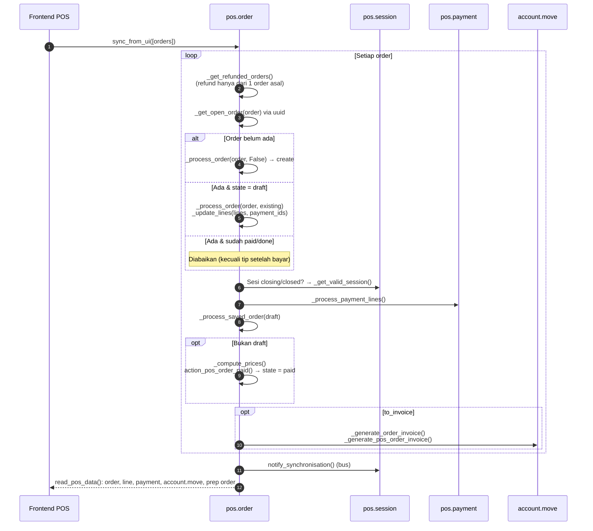

```mermaid
sequenceDiagram
    autonumber
    participant UI as Frontend POS
    participant O as pos.order
    participant S as pos.session
    participant P as pos.payment
    participant M as account.move

    UI->>O: sync_from_ui([orders])
    loop Setiap order
        O->>O: _get_refunded_orders()<br/>(refund hanya dari 1 order asal)
        O->>O: _get_open_order(order) via uuid
        alt Order belum ada
            O->>O: _process_order(order, False) → create
        else Ada & state = draft
            O->>O: _process_order(order, existing)<br/>_update_lines(lines, payment_ids)
        else Ada & sudah paid/done
            Note over O: Diabaikan (kecuali tip setelah bayar)
        end
        O->>S: Sesi closing/closed? → _get_valid_session()
        O->>P: _process_payment_lines()
        O->>O: _process_saved_order(draft)
        opt Bukan draft
            O->>O: _compute_prices()<br/>action_pos_order_paid() → state = paid
        end
        opt to_invoice
            O->>M: _generate_order_invoice()<br/>_generate_pos_order_invoice()
        end
    end
    O->>S: notify_synchronisation() (bus)
    O-->>UI: read_pos_data(): order, line, payment, account.move, prep order
```

---

_Sumber: dokumentasi_pos_odoo.md §7_
