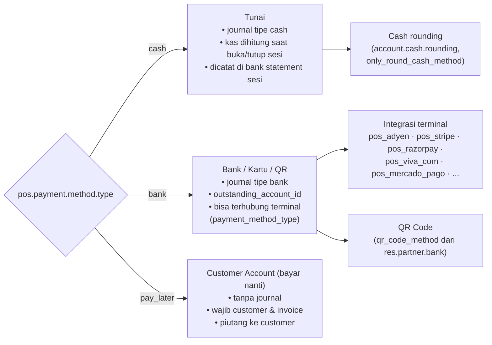

```mermaid
flowchart LR
    PM{"pos.payment.method.type"}
    PM -- cash --> CASH["Tunai<br/>• journal tipe cash<br/>• kas dihitung saat buka/tutup sesi<br/>• dicatat di bank statement sesi"]
    PM -- bank --> BANK["Bank / Kartu / QR<br/>• journal tipe bank<br/>• outstanding_account_id<br/>• bisa terhubung terminal<br/>(payment_method_type)"]
    PM -- pay_later --> PL["Customer Account (bayar nanti)<br/>• tanpa journal<br/>• wajib customer & invoice<br/>• piutang ke customer"]

    BANK --> TERM["Integrasi terminal<br/>pos_adyen · pos_stripe · pos_razorpay ·<br/>pos_viva_com · pos_mercado_pago · ..."]
    BANK --> QR["QR Code<br/>(qr_code_method dari res.partner.bank)"]
    CASH --> ROUND["Cash rounding<br/>(account.cash.rounding,<br/>only_round_cash_method)"]
```

`action_pos_order_paid()` memvalidasi bahwa `amount_total − amount_paid = 0`. Jika *cash rounding* aktif, selisih diperbolehkan sampai batas pembulatan.

---

_Sumber: dokumentasi_pos_odoo.md §8_
