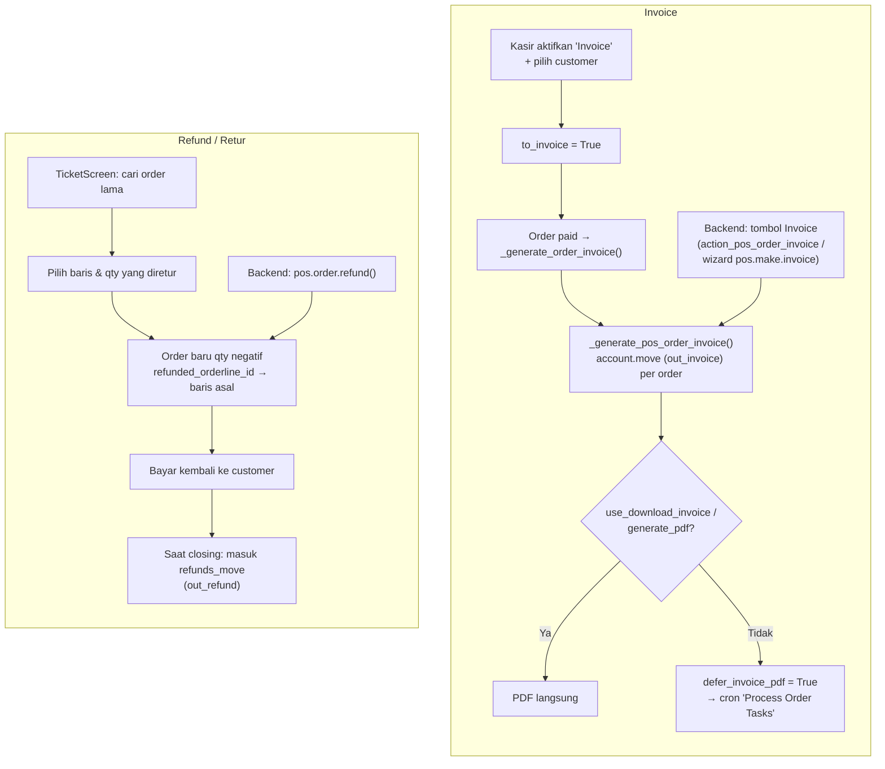

```mermaid
flowchart TB
    subgraph INV["Invoice"]
        direction TB
        I1["Kasir aktifkan 'Invoice'<br/>+ pilih customer"] --> I2["to_invoice = True"]
        I2 --> I3["Order paid → _generate_order_invoice()"]
        I3 --> I4["_generate_pos_order_invoice()<br/>account.move (out_invoice) per order"]
        I4 --> I5{"use_download_invoice /<br/>generate_pdf?"}
        I5 -- Ya --> I6["PDF langsung"]
        I5 -- Tidak --> I7["defer_invoice_pdf = True<br/>→ cron 'Process Order Tasks'"]
        B1["Backend: tombol Invoice<br/>(action_pos_order_invoice /<br/>wizard pos.make.invoice)"] --> I4
    end

    subgraph REF["Refund / Retur"]
        direction TB
        R1["TicketScreen: cari order lama"] --> R2["Pilih baris & qty yang diretur"]
        R2 --> R3["Order baru qty negatif<br/>refunded_orderline_id → baris asal"]
        R3 --> R4["Bayar kembali ke customer"]
        R4 --> R5["Saat closing: masuk refunds_move<br/>(out_refund)"]
        R6["Backend: pos.order.refund()"] --> R3
    end
```

---

_Sumber: dokumentasi_pos_odoo.md §10_
