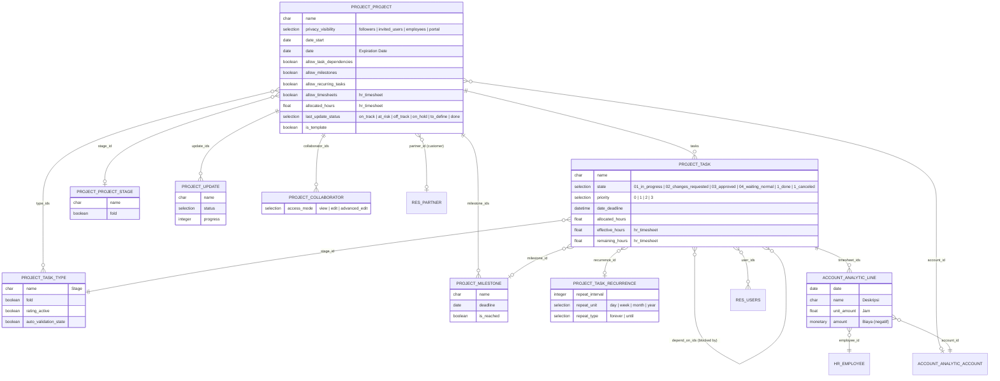

```mermaid
erDiagram
    PROJECT_PROJECT {
        char name
        selection privacy_visibility "followers | invited_users | employees | portal"
        date date_start
        date date "Expiration Date"
        boolean allow_task_dependencies
        boolean allow_milestones
        boolean allow_recurring_tasks
        boolean allow_timesheets "hr_timesheet"
        float allocated_hours "hr_timesheet"
        selection last_update_status "on_track | at_risk | off_track | on_hold | to_define | done"
        boolean is_template
    }
    PROJECT_TASK {
        char name
        selection state "01_in_progress | 02_changes_requested | 03_approved | 04_waiting_normal | 1_done | 1_canceled"
        selection priority "0 | 1 | 2 | 3"
        datetime date_deadline
        float allocated_hours
        float effective_hours "hr_timesheet"
        float remaining_hours "hr_timesheet"
    }
    PROJECT_TASK_TYPE {
        char name "Stage"
        boolean fold
        boolean rating_active
        boolean auto_validation_state
    }
    PROJECT_PROJECT_STAGE {
        char name
        boolean fold
    }
    PROJECT_MILESTONE {
        char name
        date deadline
        boolean is_reached
    }
    PROJECT_UPDATE {
        char name
        selection status
        integer progress
    }
    PROJECT_COLLABORATOR {
        selection access_mode "view | edit | advanced_edit"
    }
    PROJECT_TASK_RECURRENCE {
        integer repeat_interval
        selection repeat_unit "day | week | month | year"
        selection repeat_type "forever | until"
    }
    ACCOUNT_ANALYTIC_LINE {
        date date
        char name "Deskripsi"
        float unit_amount "Jam"
        monetary amount "Biaya (negatif)"
    }

    PROJECT_PROJECT ||--o{ PROJECT_TASK : tasks
    PROJECT_PROJECT }o--o{ PROJECT_TASK_TYPE : type_ids
    PROJECT_PROJECT }o--o| PROJECT_PROJECT_STAGE : stage_id
    PROJECT_PROJECT }o--o| ACCOUNT_ANALYTIC_ACCOUNT : account_id
    PROJECT_PROJECT ||--o{ PROJECT_MILESTONE : milestone_ids
    PROJECT_PROJECT ||--o{ PROJECT_UPDATE : update_ids
    PROJECT_PROJECT ||--o{ PROJECT_COLLABORATOR : collaborator_ids
    PROJECT_PROJECT }o--o| RES_PARTNER : "partner_id (customer)"
    PROJECT_TASK }o--|| PROJECT_TASK_TYPE : stage_id
    PROJECT_TASK }o--o{ RES_USERS : user_ids
    PROJECT_TASK }o--o| PROJECT_TASK : "parent_id (sub-task)"
    PROJECT_TASK }o--o{ PROJECT_TASK : "depend_on_ids (blocked by)"
    PROJECT_TASK }o--o| PROJECT_MILESTONE : milestone_id
    PROJECT_TASK }o--o| PROJECT_TASK_RECURRENCE : recurrence_id
    PROJECT_TASK ||--o{ ACCOUNT_ANALYTIC_LINE : timesheet_ids
    ACCOUNT_ANALYTIC_LINE }o--|| HR_EMPLOYEE : employee_id
    ACCOUNT_ANALYTIC_LINE }o--|| ACCOUNT_ANALYTIC_ACCOUNT : account_id
```

---

_Sumber: dokumentasi_project_odoo.md §2_
