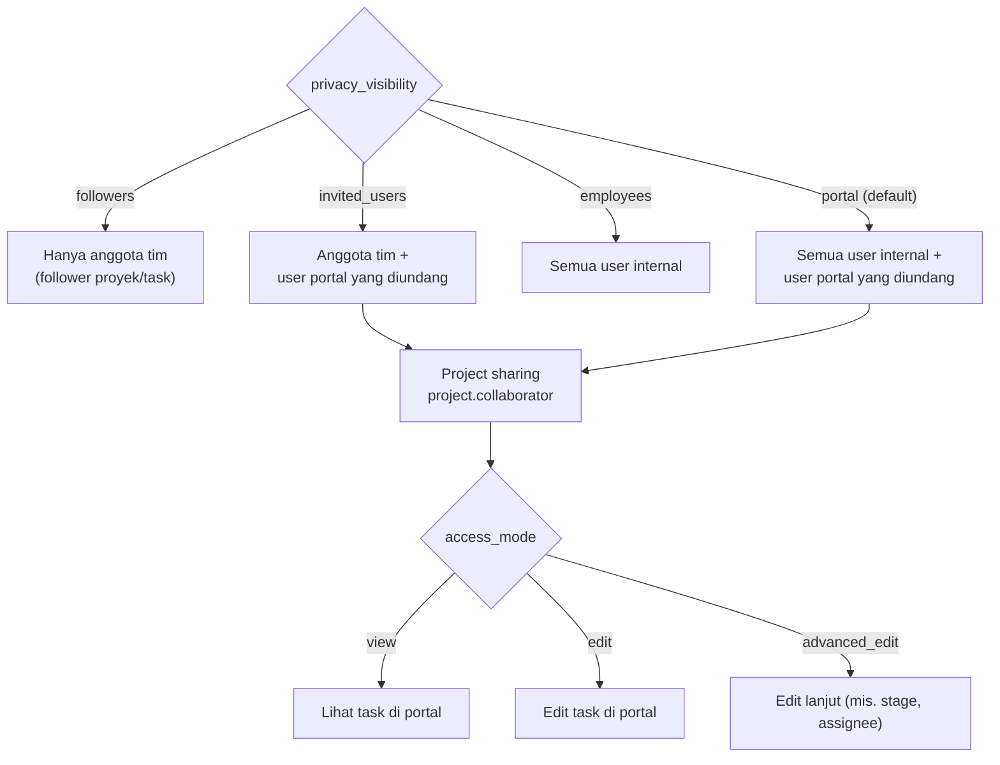

```mermaid
flowchart TB
    V{"privacy_visibility"}
    V -- "followers" --> F["Hanya anggota tim<br/>(follower proyek/task)"]
    V -- "invited_users" --> I["Anggota tim +<br/>user portal yang diundang"]
    V -- "employees" --> E["Semua user internal"]
    V -- "portal (default)" --> P["Semua user internal +<br/>user portal yang diundang"]

    I --> SH["Project sharing<br/>project.collaborator"]
    P --> SH
    SH --> M{"access_mode"}
    M -- "view" --> MV["Lihat task di portal"]
    M -- "edit" --> ME["Edit task di portal"]
    M -- "advanced_edit" --> MA["Edit lanjut (mis. stage, assignee)"]
```

---

_Sumber: dokumentasi_project_odoo.md §5_
