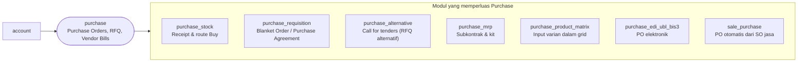

Modul `purchase` **hanya bergantung pada `account`**. Penerimaan barang ditambahkan oleh `purchase_stock`.

```mermaid
flowchart LR
    ACC["account"] --> PUR(["purchase<br/>Purchase Orders, RFQ, Vendor Bills"])

    subgraph EXT["Modul yang memperluas Purchase"]
        direction TB
        purchase_stock["purchase_stock<br/>Receipt & route Buy"]
        purchase_requisition["purchase_requisition<br/>Blanket Order / Purchase Agreement"]
        purchase_alternative["purchase_alternative<br/>Call for tenders (RFQ alternatif)"]
        purchase_mrp["purchase_mrp<br/>Subkontrak & kit"]
        purchase_product_matrix["purchase_product_matrix<br/>Input varian dalam grid"]
        purchase_edi["purchase_edi_ubl_bis3<br/>PO elektronik"]
        sale_purchase["sale_purchase<br/>PO otomatis dari SO jasa"]
    end

    PUR --> EXT
```

---

_Sumber: dokumentasi_purchase_odoo.md §1_
