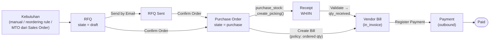

```mermaid
flowchart LR
    A["Kebutuhan<br/>(manual / reordering rule /<br/>MTO dari Sales Order)"] --> B["RFQ<br/>state = draft"]
    B -->|"Send by Email"| C["RFQ Sent"]
    C -->|"Confirm Order"| D["Purchase Order<br/>state = purchase"]
    B -->|"Confirm Order"| D
    D -->|"purchase_stock:<br/>_create_picking()"| E["Receipt<br/>WH/IN"]
    E -->|"Validate →<br/>qty_received"| F["Vendor Bill<br/>(in_invoice)"]
    D -->|"Create Bill<br/>(policy: ordered qty)"| F
    F -->|"Register Payment"| G["Payment<br/>(outbound)"]
    G --> H(["Paid"])
```

---

_Sumber: dokumentasi_purchase_odoo.md §4_
