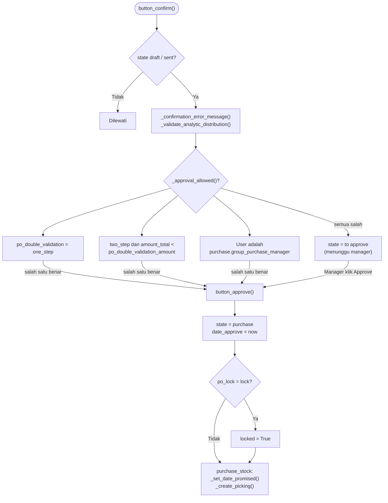

```mermaid
flowchart TB
    A(["button_confirm()"]) --> B{"state draft / sent?"}
    B -- Tidak --> X["Dilewati"]
    B -- Ya --> C["_confirmation_error_message()<br/>_validate_analytic_distribution()"]
    C --> D{"_approval_allowed()?"}
    D --> D1["po_double_validation = one_step"]
    D --> D2["two_step dan amount_total <<br/>po_double_validation_amount"]
    D --> D3["User adalah<br/>purchase.group_purchase_manager"]
    D1 & D2 & D3 -->|"salah satu benar"| E["button_approve()"]
    D -->|"semua salah"| F["state = to approve<br/>(menunggu manager)"]
    F -->|"Manager klik Approve"| E
    E --> G["state = purchase<br/>date_approve = now"]
    G --> H{"po_lock = lock?"}
    H -- Ya --> I["locked = True"]
    H -- Tidak --> J
    I --> J["purchase_stock:<br/>_set_date_promised()<br/>_create_picking()"]
```

---

_Sumber: dokumentasi_purchase_odoo.md §5_
